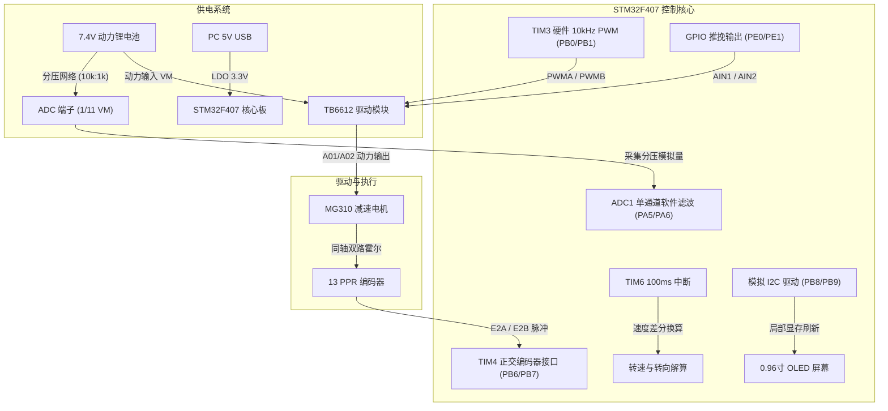

# 深度技术复盘与实战报告：TB6612 电机测速、OLED 监控与 ADC 采样系统

> **工程仓库归档**：[`homework/Motor_Encoder_OLED_Monitor/`](Motor_Encoder_OLED_Monitor/)  
> **实验平台**：STM32F407ZGT6（探索者架构） + TB6612FNG 调压驱动模块 + MG310 直流减速电机（带增量霍尔编码器） + 0.96寸 I2C OLED (SSD1306) + 7.4V 2S 动力锂电池组  
> **日期**：2026-09-07  
> **编写者**：Serendipity

---

## 目录
- [一、 系统架构与功能全貌](#一-系统架构与功能全貌)
- [二、 完整硬件接线拓扑表](#二-完整硬件接线拓扑表)
- [三、 核心测量机理与数学推导](#三-核心测量机理与数学推导)
- [四、 四大疑难故障与底层排查深度复盘](#四-四大疑难故障与底层排查深度复盘)
  - [4.1 复盘一：关于“电流”的认知误区与物理硬件限制](#41-复盘一关于电流的认知误区与物理硬件限制)
  - [4.2 复盘二：PA6 引脚为何固定读出 4095（折算 36.3V 满偏）？](#42-复盘二pa6-引脚为何固定读出-4095折算-363v-满偏)
  - [4.3 复盘三：碰触地线时采样值跳动（700~1000 / 4~10V）的成因](#43-复盘三碰触地线时采样值跳动7001000--410v的成因)
  - [4.4 复盘四：“按 Reset 锁死、电机不转、屏幕定格”的 Bootloader 陷阱](#44-复盘四按-reset-锁死电机不转屏幕定格的-bootloader-陷阱)
- [五、 当前系统已知 BUG 与局限性清单](#五-当前系统已知-bug-与局限性清单)
- [六、 演进路线与改进建议](#六-演进路线与改进建议)

---

## 一、 系统架构与功能全貌

本项目在原有 TB6612 电机调速工程的基础上，扩展了 **0.96 寸 OLED（I2C）实时参数显示屏**、**TIM4 正交编码器 4 倍频硬件测速** 与 **ADC 电池母线电压采样监控**，构成了一个具备感知、显示、执行三位一体的闭环电机驱动原型系统。



### 核心功能指标：
1. **调速控制**：TIM3 互补/多通道产生 10kHz 硬件 PWM，按键 `KEY_UP` / `KEY0` 步进 ±10% 调节占空比（0% ~ 100%）。
2. **转向与制动**：`KEY1` / `KEY2` 控制正反转，带有独立的 `Motor_Stop()` 短路制动（AIN1=AIN2=HIGH），实现急停刹车。
3. **高精度测速**：利用 TIM4 硬件正交解码模式（`TIM_EncoderMode_TI12`），实现 4 倍频采集，100ms 周期差分计算 RPM。
4. **状态显示**：0.96 寸 OLED 实时显示目标速度、当前转速（RPM）、100ms 捕获脉冲增量（PLS）以及母线电压（V）与 ADC 原始量化码（RAW）。

---

## 二、 完整硬件接线拓扑表

为彻底规避 STM32F407 探索者开发板上的板载外设冲突（如 W25Q128 Flash、LCD 屏幕背光、BOOT0 跳线等），系统经过精密排布后的引脚映射如下：

| 外设模块 | 引脚名称 | STM32F407 引脚 | 排针物理位置 | 外设功能配置 | 电气设计与说明 |
| :--- | :--- | :--- | :--- | :--- | :--- |
| **TB6612 驱动板** | **PWMA** | **PB1** | P8 Pin 35 | TIM3_CH4 复用推挽 | 10kHz PWM 调速（定时器硬件输出） |
| | **PWMB** | **PB0** | P8 Pin 36 | TIM3_CH3 复用推挽 | 同步调速输出（支持双电机同控） |
| | **AIN1 / BIN1**| **PE0** | P9 Pin 53 | GPIO 推挽输出 | 方向控制 1（远离板载 Flash PB14 片选） |
| | **AIN2 / BIN2**| **PE1** | P9 Pin 52 | GPIO 推挽输出 | 方向控制 2（远离板载 LCD 背光 PB15） |
| | **STBY** | **+3.3V** | P9 Pin 59 | 逻辑供电常高 | 驱动芯片开启使能 |
| | **GND** | **GND** | P9 Pin 55/56 | 系统公共参考地 | **动力地、驱动地与 MCU 严格单点共地** |
| | **ADC (分压)** | **PA5** *(优选)* / **PA6** | P9 Pin 51 / P8 Pin 39 | ADC1_IN5 / ADC1_IN6 模拟输入 | 采集母线分压后的模拟电压（1/11） |
| **MG310 编码器** | **E2A (A相)** | **PB6** | P8 Pin 38 | TIM4_CH1 复用上拉 | 编码器正交输入通道 1 |
| | **E2B (B相)** | **PB7** | P8 Pin 37 | TIM4_CH2 复用上拉 | 编码器正交输入通道 2 |
| | **5V / VCC** | **+5V** | P9 Pin 57/58 | 传感器电源供电 | 霍尔传感器供电（建议 3.3V 或 5V） |
| | **GND** | **GND** | P9 Pin 55/56 | 传感器地 | 与系统公共地相连 |
| **0.96寸 OLED** | **SCL** | **PB8** | P8 Pin 33 | 开漏输出 / 推挽输出 | 软件 I2C 时钟线 |
| | **SDA** | **PB9** | P8 Pin 34 | 开漏输出 / 模拟双向 | 软件 I2C 数据线 |
| | **VCC** | **+3.3V** | P9 Pin 59 | 逻辑供电 | 3.3V 稳定供电 |
| | **GND** | **GND** | P9 Pin 55/56 | 逻辑地 | 与系统公共地相连 |
| **板载 Flash 保护** | **F_CS** | **PB14** | 板载连线 | GPIO 输出推挽高电平 | **软件强制拉高，使 W25Q128 处于高阻关断态** |

---

## 三、 核心测量机理与数学推导

### 3.1 正交编码器 4 倍频测速推导

MG310 电机配有 13 线（PPR）霍尔编码器，减速箱减速比为 1:20。

1. **转子方波输出**：电机内部转子旋转 1 圈，A 相与 B 相分别输出 13 个完整方波周期。
2. **TIM4 正交倍频**：开启双边沿正交计数（`TIM_EncoderMode_TI12`），在 TI1 与 TI2 的上升沿与下降沿均计数，每个方波周期产生 4 个计数脉冲。
3. **脉冲分辨率计算**：
   - 电机转子每转 1 圈脉冲数：`P_rotor = 13 × 4 = 52`（脉冲/圈）
   - 减速输出轴每转 1 圈脉冲数：`P_shaft = 52 × 20 = 1040`（脉冲/圈）
4. **转速解算数学模型**：
   设定定时器 TIM6 产生 `T = 100ms = 0.1s` 的定时中断。在每次中断触发时，读取计数器相对于上一次的脉冲增量 `ΔP` 并清零：

$$
\text{RPS} = \frac{\Delta P}{1040 \times 0.1} = \frac{\Delta P}{104}
$$

$$
\text{RPM} = \text{RPS} \times 60 = \frac{\Delta P \times 600}{1040} = \frac{\Delta P \times 15}{26}
$$

通过该整型比例换算公式，单片机可在不消耗浮点性能的前提下，以极高效率实时解算出输出轴的每分钟实际转速（RPM）。

### 3.2 电池母线电压采样转换

TB6612 调压模块板载分压电阻网络，由 $R_1 = 10\,\text{k}\Omega$ 和 $R_2 = 1\,\text{k}\Omega$ 构成，将电池输入母线电压 $V_{\text{IN}}$ 降压为：

$$
V_{\text{ADC}} = V_{\text{IN}} \times \frac{R_2}{R_1 + R_2} = V_{\text{IN}} \times \frac{1\,\text{k}\Omega}{10\,\text{k}\Omega + 1\,\text{k}\Omega} = \frac{V_{\text{IN}}}{11}
$$

STM32F407 ADC1 配置为 12 位分辨率，参考基准电压 $V_{\text{REF}} = 336.3V，量化步长（LSB）为：

$$
\text{LSB} = \frac{3.3\,\text{V}}{4095} \approx 0.80586\,\text{mV}
$$

因此，由 ADC 原始采样码值（`ADC_RAW`，范围 0 ~ 4095）换算回真实电池母线电压的数学表达式为：

$$
V_{\text{IN}} = ADC_{\text{RAW}} \times \frac{3.3\,\text{V}}{4095} \times 11 = ADC_{\text{RAW}} \times \frac{36.3\,\text{V}}{4095}
$$

若 ADC 读到满量程 4095，则计算值为 36.3V。

---

## 四、 四大疑难故障与底层排查深度复盘

在实际调试中，系统曾出现诸如“电压固定显示 36.3V”、“电流读数为 4095”、“触碰排针数值剧烈跳动”、“单片机按复位键后无反应且锁死”等一系列复杂现象。以下对其底层物理原因进行严密排查与复盘：

### 4.1 复盘一：关于“电流”的认知误区与物理硬件限制
- **故障现象**：OLED 初始界面显示 `V: 36.3V A: 4095`，调试过程中用户疑惑为什么“电流”一直显示 4095 或上千的数值？
- **底层真相**：
  1. **驱动板无检流元件**：翻查商家 TB6612 模块原理图，该板仅引出了一路 `ADC` 引脚。该引脚内部直接连接在 10k:1k 分压电阻中点，用以检测母线电压。板上**没有任何检流电阻（Shunt Resistor）、差分运算放大器或专用的霍尔电流检测芯片（如 ACS712/INA219）**。因此，该模块在硬件上**根本不具备测量电流的物理能力**！
  2. **字母“A”引发的误会**：先前屏幕上显示的 `A: 4095`，字母 `A` 并非安培（Amperes），而是 **ADC 原始量化码（ADC Raw Code 0~4095）** 的英文缩写！
- **整改措施**：在代码中将显示文本彻底更正为 `RAW: xxxx`，消除“电流”歧义，明确标明该数值代表 ADC 采样的 12 位裸数据。

---

### 4.2 复盘二：PA6 引脚为何固定读出 4095（折算 36.3V 满偏）？
- **故障现象**：当外部接线接入 PA6 时，无论电机是否转动，屏幕始终死锁在 `V: 36.3V  RAW: 4095`。
- **硬件冲突溯源**：
  翻阅 STM32F407 探索者开发板原理图发现：
  ```
  PA6  ───┬───> P8 Pin 39 (外部扩展排针)
          └───> W25Q128 (板载 SPI Flash) 的 SO (MISO / Pin 2)
  PB14 ───────> W25Q128 的 /CS (片选脚 / Pin 1)
  ```
  - 当工程初始代码未对 `PB14` 进行显式控制时，`PB14` 处于开漏浮空或低电平状态，使得板载 **W25Q128 SPI Flash 芯片被硬件选中使能**。
  - Flash 芯片内部的输出缓冲器强行将 `SO` 引脚（即 `PA6`）驱动为高电平（3.3V CMOS 强推挽）。
  - 外部从 TB6612 分压电阻过来的信号内阻较高（约 0.9kΩ ~ 1kΩ），根本无法撼动 Flash 芯片内部的强推挽输出，导致单片机内部 ADC 始终采到满量程 3.3V（4095），根据公式换算即为恒定的 36.3V！
- **排查与解决之道**：
  1. **软件禁能 Flash**：在 `ADC_Init()` 中显式配置 `PB14` 为推挽输出，并拉高：
     ```c
     GPIO_InitStructure.GPIO_Pin = GPIO_Pin_14;
     GPIO_InitStructure.GPIO_Mode = GPIO_Mode_OUT;
     GPIO_Init(GPIOB, &GPIO_InitStructure);
     GPIO_SetBits(GPIOB, GPIO_Pin_14); // 禁用 W25Q128 片选，使其 SO 处于高阻态
     ```
  2. **引脚物理迁移（最佳工程实践）**：为了从根本上隔离潜在的板载外设串扰，将 ADC 采样迁移至纯净的 **`PA5`（ADC1_IN5，P9 Pin 51）**。PA5 不与开发板任何板载芯片复用，且物理位置紧邻 PE0/PE1，布线极度整洁安全。

---

### 4.3 复盘三：碰触地线时采样值跳动（700~1000 / 4~10V）的成因
- **故障现象**：当用户用手捏着杜邦线碰触 STM32 的 GND 排针时，屏幕显示电压在 4~10V 跳动，ADC 读数在 700~1000 间大幅震荡。
- **成因剖析**：
  1. **人体工频感应天线效应**：人体处于现代交流电网环境中，相当于一根等效电容天线，体内带有约数十至数百毫伏的 50Hz 工频电磁感应电压。
  2. **轻触造成的接触电阻与虚接**：当手指轻捏杜邦线碰触金属排针表面时，存在极高的动态接触电阻和寄生电容。人体感应交流电注入 ADC 输入通道（输入阻抗高达数兆欧），导致瞬时采样电压在 0.5V ~ 0.8V 波动。
  3. **分压倍数放大**：由于算法中乘上了 11 倍的分压换算比例，0.6V 的感应电压被直接折算为 0.6V × 11 = 6.6V，造成了屏幕数值“剧烈跳变”的视觉冲击。
- **结论**：将杜邦线坚实插入母座使金属簧片完全闭合后，读数立刻跌落为稳定 0。

---

### 4.4 复盘四：“按 Reset 锁死、电机不转、屏幕定格”的 Bootloader 陷阱
- **故障现象**：在排查过程中，用户拔掉 USB 数据线仅保留 J-Link 仿真器供电，按下开发板复位键后，电机停转，按键全部失效，屏幕定格在上次画面不动。
- **J-Link 底层寄存器排查**：
  通过 J-Link 命令行工具读取 MCU 寄存器与内存状态：
  ```
  PC = 0x1FFF3694
  R0 = 0x00000000, R1 = 0x40023800
  ```
  - STM32F407 的用户 Flash 起始地址为 `0x08000000`。
  - `0x1FFF0000 ~ 0x1FFF77FF` 是 **ST 官方出厂固化的系统存储区（System Memory Bootloader / ROM DFU 模式）**！
  - 显然，MCU 并没有从 Flash 启动，而是陷入了官方 Bootloader。
- **机理追溯**：
  - 查阅 P8 扩展排针表，**P8 Pin 50 正是 `BOOT0` 引脚**！
  - 在 P8 排针附近盲插或调整跳线、或者拔掉 USB 线引起地电位浮动时，`BOOT0` 引脚被意外带到了高电平。单片机在复位采样的瞬间检测到 `BOOT0 = 1, BOOT1 = 0`，判定用户要求进入串口下载模式，故放弃执行用户代码。
  - 由于 OLED 模块内部集成了控制器与显存（GDDRAM），在单片机陷入 Bootloader 不再输出信号时，OLED 屏幕只要不断电就会持续刷新最后一帧静态图像，给人以“程序死机在特定画面”的错觉。
- **规范标准**：恢复稳定 USB 5V 供电，将 `BOOT0` 牢固跳线至 GND，MCU 即恢复正常的上电执行逻辑。

---

## 五、 当前系统已知 BUG 与局限性清单

在当前交付的代码与系统架构中，仍存在以下设计局限与潜在 BUG，需在后续版本迭代中予以关注：

### 🔴 BUG 1: 缺少真实电流测量硬件，无法进行电流闭环控制
- **问题描述**：当前 TB6612 模块无电流采样分流电阻与检流芯片，无法获知电机相电流或母线电流大小。
- **影响**：无法实现过流堵转保护、力矩闭环控制（FOC/双闭环 PID 中的内环电流环）。
- **优化方案**：在电机负极回路中串入 0.05Ω ~ 0.1Ω 康铜分流电阻搭配放大电路，或外挂 INA219 / INA226（I2C 接口 16 位高侧检流芯片）。

### 🟡 BUG 2: 自由轮询 ADC 易受电机 PWM 斩波反电动势污染
- **问题描述**：当前 ADC 采样采用主循环软件单次触发方式。当电机处于 PWM 高频斩波状态时，母线上存在剧烈的 MOS 管开关纹波与电机反电动势毛刺。
- **影响**：母线电压读数在电机加速或高速转动时可能产生 ±0.3V 的轻微跳字。
- **优化方案**：利用定时器主从触发（Timer Trigger ADC），将 ADC 采样点精确锁定在 PWM 导通周期的正中点（避开开关尖峰），并在软件中加入一阶滞后低通滤波（IIR Filter）或滑动窗口平均滤波。

### 🟡 BUG 3: 双路 PWM 输出与单编码器反馈的不对称性
- **问题描述**：代码中 TIM3_CH3 (PB0) 与 TIM3_CH4 (PB1) 同步输出相同占空比，但硬件上仅连接了单个 MG310 电机的编码器（TIM4）。
- **影响**：如果接入双路电机，由于两台电机机械加工容差与摩擦阻力差异，开环输出相同 PWM 会导致双轮转速不一致（跑偏）。
- **优化方案**：为通道 B 增加另一组正交定时器（如 TIM5 / TIM2）捕获另一路编码器脉冲，实现双路独立 PID 调速。

### 🟢 BUG 4: 软件模拟 I2C 阻塞主循环实时性
- **问题描述**：当前 OLED 驱动使用软件 GPIO 延时翻转模拟 I2C，整屏或多行显存数据刷新耗时约为 10ms ~ 20ms。
- **影响**：在 OLED 刷屏期间，CPU 无法响应主循环中的其他非中断任务。
- **优化方案**：后续可将 OLED 驱动移植为硬件 I2C + DMA 传输，或减少局部字符刷新区域，避免无谓的整行擦写。

---

## 六、 演进路线与改进建议

1. **第一阶段（已完成）**：PWM 调速控制、方向制动切换、正交编码器 4 倍频硬件测速、OLED 动态参数监控、ADC 母线电压监测。
2. **第二阶段（进阶规划）**：
   - 引入 **增量式 / 位置式 PID 闭环调速算法**：以设定 RPM 为目标值，编码器测速为反馈值，实时动态调节 PWM 占空比，实现负载变化下的恒速转动。
   - 引入 **硬件 I2C + DMA 传输机制**：彻底解放 CPU 主循环。
