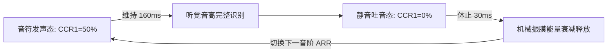

# 🎵 STM32F407 蜂鸣器硬件 PWM 驱动与八音阶演奏原理全解析

> **归档日期**：2026年9月8日  
> **工程项目**：[`PWM_waveform/`](PWM_waveform/)  
> **核心硬件**：STM32F407ZGT6 开发板、板载无源蜂鸣器 (PF8)、S8050 NPN 驱动三极管、0.96 寸 I2C OLED 显示屏、独立用户按键 (KEY0, KEY1, KEY_UP)、LED0 (PF9)  
> **主控芯片内核**：ARM Cortex-M4 @ 168 MHz (支持 FPU 与 DSP)

---

## 目录
- [一、 硬件电路原理与定时器选型深度论证](#一-硬件电路原理与定时器选型深度论证)
  - [1.1 蜂鸣器驱动硬件电路分析](#11-蜂鸣器驱动硬件电路分析)
  - [1.2 为什么必须选用定时器 TIM13？](#12-为什么必须选用定时器-tim13)
  - [1.3 无源蜂鸣器发声机理与 PWM 驱动本质](#13-无源蜂鸣器发声机理与-pwm-驱动本质)
- [二、 时钟树架构与 PWM 计数参数推导](#二-时钟树架构与-pwm-计数参数推导)
  - [2.1 APB1 定时器 84 MHz 时钟源推导](#21-apb1-定时器-84-mhz-时钟源推导)
  - [2.2 1 MHz 计数基准与预分频器 (PSC) 计算](#22-1-mhz-计数基准与预分频器-psc-计算)
  - [2.3 周期、频率与自动重装载值 (ARR) 换算公式](#23-周期频率与自动重装载值-arr-换算公式)
  - [2.4 50% 对称方波占空比 (CCR1) 与静音控制](#24-50-对称方波占空比-ccr1-与静音控制)
- [三、 经典自然大调八音阶 (Do~High Do) 数学推导与实现](#三-经典自然大调八音阶-dohigh-do-数学推导与实现)
  - [3.1 十二平均律与物理频率换算](#31-十二平均律与物理频率换算)
  - [3.2 自然大调八音阶物理频率与寄存器参数全景表](#32-自然大调八音阶物理频率与寄存器参数全景表)
- [四、 循环演奏与时域包络节拍控制原理](#四-循环演奏与时域包络节拍控制原理)
  - [4.1 发声持续时间 (Tone Duration) 的听觉建立](#41-发声持续时间-tone-duration-的听觉建立)
  - [4.2 顿音休止时间 (Silent Interval) 的抑振机理](#42-顿音休止时间-silent-interval-的抑振机理)
  - [4.3 循环播放算法流程图与时序设计](#43-循环播放算法流程图与时序设计)
- [五、 软件工程架构与核心源码解析](#五-软件工程架构与核心源码解析)
  - [5.1 蜂鸣器底层驱动模块 (`beep.h` / `beep.c`)](#51-蜂鸣器底层驱动模块-beeph--beepc)
  - [5.2 交互测试主程序 (`main.c`) 逻辑实现](#52-交互测试主程序-mainc-逻辑实现)
- [六、 编译构建与硬件测试验证](#六-编译构建与硬件测试验证)

---

## 一、 硬件电路原理与定时器选型深度论证

### 1.1 蜂鸣器驱动硬件电路分析
在微控制器系统中，蜂鸣器属于感性大电流负载（工作瞬态电流通常在 30 mA ~ 100 mA），而 STM32 的 GPIO 单引脚最大灌电流/拉电流仅为 25 mA，因此绝对不能使用 GPIO 直接驱动蜂鸣器，必须通过功率开关器件进行放大隔离。

查阅开发板原理图（`STM32F407_原理图.pdf`）：
* **控制端口**：板载蜂鸣器驱动信号网络标号为 `BEEP`，直连主控 MCU 的 **`PF8`** 引脚。
* **放大电路**：采用 NPN 双极型晶体管 **Q2 (S8050)** 构成低端开关驱动电路：
  * **基极回路**：`PF8` 经过 1 kΩ 限流电阻（R45）连接至 S8050 基极（B）；
  * **下拉偏置**：基极并联 10 kΩ 下拉电阻（R42）至 GND，保证单片机上电复位或引脚浮空时基极被可靠拉低，三极管截止，杜绝不可控的开机杂音；
  * **集电极回路**：蜂鸣器正极端接入系统 `+5V` 电源，负极端接入 S8050 集电极（C），发射极（E）接地（集电极开路负载驱动）。
* **电气驱动逻辑**：
  * `PF8 = 1`（高电平）：基极注入电流，S8050 进入深度饱和导通状态，集电极电压拉低至接近 0.2V，蜂鸣器两端获得近 4.8V 驱动压降并导通发声；
  * `PF8 = 0`（低电平）：基极电位为 0V，S8050 截止，回路断开，蜂鸣器完全静音。

### 1.2 为什么必须选用定时器 TIM13？
在 STM32 微控制器中，实现纯硬件 PWM 必须依托具备“输出比较（Output Compare）”功能的通用或高级定时器，且引脚必须具备对应的定时器通道复用映射。

查阅 ST 官方《STM32F407 数据手册》（Datasheet）引脚复用映射表（Alternate Function Mapping）：
* **`PF8` 引脚复用功能定义**：
  * `AF9`：**`TIM13_CH1`**
  * `AF12`：`FSMC_NIOWR`
  * 模拟输入通道：`ADC3_IN6`
* **硬件选型唯一性论证**：
  在整个 STM32F407 芯片多达 144 个引脚中，**`TIM13_CH1` 是唯一与板载蜂鸣器引脚 `PF8` 物理硬连接的定时器通道**。
  采用 TIM13 通道 1 驱动蜂鸣器，直接走板载高可靠性铜皮布线，**无需任何外部杜邦线飞线跳线**，从根本上杜绝了接触不良与外部电磁干扰，是硬件工程规范下的最佳也是唯一选择。

### 1.3 无源蜂鸣器发声机理与 PWM 驱动本质
板载蜂鸣器为**电磁式无源蜂鸣器**（内部不带自激振荡电路）：
* 内部由电磁线圈、磁铁与高弹性振动金属膜片组成；
* 若给其通入恒定直流电，电磁线圈只产生恒定吸力，金属膜片被持续吸附吸平，无法引起周围空气周期性压缩与膨胀，因而只能在接通和断开瞬间发出微弱的“咔哒”声，无法持续鸣叫；
* **必须向其输入周期性变化的交变方波（PWM）**：驱动三极管按特定频率周期性开关，电磁铁交替产生“吸合-释放-吸合-释放”的往复机械运动，迫使振动簧片以方波频率振动并撞击共鸣腔，推动空气向外辐射特定频率的声波。

---

## 二、 时钟树架构与 PWM 计数参数推导

### 2.1 APB1 定时器 84 MHz 时钟源推导
STM32F407 采用外部 8.000 MHz 石英晶振（HSE）作为主基准源。系统启动后由主锁相环（Main PLL）进行倍频倍频，时钟链路如下：

1. **PLL VCO 输入频率**：
   $$f_{\text{VCO\_IN}} = \frac{f_{\text{HSE}}}{\text{PLL\_M}} = \frac{8\text{ MHz}}{8} = 1\text{ MHz}$$
2. **PLL VCO 压控振荡频率**：
   $$f_{\text{VCO\_OUT}} = f_{\text{VCO\_IN}} \times \text{PLL\_N} = 1\text{ MHz} \times 336 = 336\text{ MHz}$$
3. **系统主频 (SYSCLK)**：
   $$\text{SYSCLK} = \frac{f_{\text{VCO\_OUT}}}{\text{PLL\_P}} = \frac{336\text{ MHz}}{2} = 168\text{ MHz}$$
4. **低速外设总线 APB1 时钟 (PCLK1)**：
   $$\text{PCLK1} = \frac{\text{HCLK}}{\text{APB1\_DIV}} = \frac{168\text{ MHz}}{4} = 42\text{ MHz}$$
5. **TIM13 计数器输入时钟 ($f_{\text{TIM13}}$)**：
   依据 STM32F4xx 参考手册规定：**当 APB1 分频系数不为 1 时，送往 APB1 定时器的时钟自动硬件 2 倍频**：
   $$f_{\text{TIM13}} = \text{PCLK1} \times 2 = 42\text{ MHz} \times 2 = 84\text{ MHz}$$

---

### 2.2 1 MHz 计数基准与预分频器 (PSC) 计算
为了让音频频率计算直观且消除除法舍入误差，我们将定时器的预分频器配置为将 84 MHz 降频至标准的 **1 MHz**：
$$f_{\text{cnt}} = \frac{f_{\text{TIM13}}}{\text{PSC} + 1} = 1\,000\,000\text{ Hz} = 1\text{ MHz}$$
由此解出预分频寄存器（TIM_Prescaler）配置值：
$$\text{PSC} = \frac{84\,000\,000}{1\,000\,000} - 1 = 84 - 1 = 83$$
* **计数分辨率**：计数器每增加 1，刚好对应时间过去 $1\ \mu\text{s}$。

---

### 2.3 周期、频率与自动重装载值 (ARR) 换算公式
定时器采用向上计数模式，从 0 计数到自动重装载寄存器（`TIM_Period`，即 ARR）的值后归零并产生溢出，该完整计数循环即为一个完整的 PWM 周期：
$$T_{\text{PWM}} = \frac{\text{ARR} + 1}{f_{\text{cnt}}}$$
对应的 PWM 输出基频为：
$$f_{\text{PWM}} = \frac{f_{\text{cnt}}}{\text{ARR} + 1} = \frac{1\,000\,000}{\text{ARR} + 1}$$
反推得到任意目标音频频率 $f_{\text{PWM}}$ 下的自动重装载寄存器值：
$$\text{ARR} = \frac{1\,000\,000}{f_{\text{PWM}}} - 1$$

---

### 2.4 50% 对称方波占空比 (CCR1) 与静音控制
占空比（Duty Cycle）定义为单周期内高电平持续时间与总周期时间之比：
$$\text{Duty} = \frac{\text{CCR1}}{\text{ARR} + 1} \times 100\%$$
* **最佳对称方波发声 (50% 占空比)**：
  在声学驱动中，50% 占空比能够给振膜提供完全平衡对称的充放磁时间，机械共振能量最大、发声响度最高且音质纯净：
  $$\text{CCR1} = \frac{\text{ARR} + 1}{2}$$
* **绝对静音控制 (0% 占空比)**：
  将比较捕获寄存器置零：
  $$\text{CCR1} = 0$$
  此时定时器无论处于何种计数状态，比较器匹配输出始终为恒定低电平，S8050 三极管截止，实现硬件级完全静音。

---

## 三、 经典自然大调八音阶 (Do~High Do) 数学推导与实现

### 3.1 十二平均律与物理频率换算
在现代乐理标准（十二平均律）中，一个八度被等比划分为 12 个半音。若以国际标准基准音 $A4 = 440\text{ Hz}$ 为基准，任意两相邻半音之间的频率公比为：
$$r = \sqrt[12]{2} \approx 1.059463094$$
自然大调（Major Scale）的各级音程关系遵循经典的 **“全-全-半-全-全-全-半”** 规律，中音 C 调（C4 ~ C5）八个核心音符的理论计算频率如下：
* 主音 $C4$：以 $A4 = 440\text{ Hz}$ 向下推算 9 个半音，得到理论频率 $f = 440 \times 2^{-9/12} \approx 261.63\text{ Hz}$（工程取整 $262\text{ Hz}$）；
* 高八度主音 $C5$：频率严格等于 $C4$ 的 2 倍，即 $261.63 \times 2 = 523.25\text{ Hz}$（工程取整 $523\text{ Hz}$）。

---

### 3.2 自然大调八音阶物理频率与寄存器参数全景表

基于前面推导的 1 MHz 计数基准公式：
$$\text{ARR} = \frac{1\,000\,000}{f} - 1,\quad \text{CCR1} = \frac{\text{ARR} + 1}{2}$$

八音阶完整参数速查对照如下：

| 音名 (简谱) | 音阶标识 | 国际唱名 | 物理基频 ($f$) | 理论周期 ($T$) | 自动重装载值 ($\text{ARR}$) | 50% 比较值 ($\text{CCR1}$) | 音程步进 |
| :---: | :---: | :---: | :---: | :---: | :---: | :---: | :---: |
| **1 (Do)** | `BEEP_NOTE_C4` | 多 | **262 Hz** | $3816.8\ \mu\text{s}$ | **3815** | **1908** | 主音 |
| **2 (Re)** | `BEEP_NOTE_D4` | 来 | **294 Hz** | $3401.4\ \mu\text{s}$ | **3400** | **1700** | 全音 |
| **3 (Mi)** | `BEEP_NOTE_E4` | 米 | **330 Hz** | $3030.3\ \mu\text{s}$ | **3029** | **1515** | 全音 |
| **4 (Fa)** | `BEEP_NOTE_F4` | 发 | **349 Hz** | $2865.3\ \mu\text{s}$ | **2864** | **1432** | 半音 |
| **5 (Sol)** | `BEEP_NOTE_G4` | 唆 | **392 Hz** | $2551.0\ \mu\text{s}$ | **2550** | **1275** | 全音 |
| **6 (La)** | `BEEP_NOTE_A4` | 拉 | **440 Hz** | $2272.7\ \mu\text{s}$ | **2271** | **1136** | 全音(基准) |
| **7 (Si)** | `BEEP_NOTE_B4` | 西 | **494 Hz** | $2024.3\ \mu\text{s}$ | **2023** | **1012** | 全音 |
| **1̇ (High Do)**| `BEEP_NOTE_C5` | 高音多 | **523 Hz** | $1912.0\ \mu\text{s}$ | **1911** | **956** | 半音(倍频) |

---

## 四、 循环演奏与时域包络节拍控制原理

播放旋律不仅仅是在频率上做离散切换，更重要的是在**时域（Time Domain）上控制声音的起振、维持与衰减包络**。



### 4.1 发声持续时间 (Tone Duration) 的听觉建立
在心理声学中，人耳基底膜与听觉神经对单一稳定频率的音高识别需要一定的积分时间：
* 若发声时间小于 20 ms，人耳只能听到机械“噼啪”声而无法辨识音调；
* 本工程选取 **$T_{\text{sound}} = 160\text{ ms}$**，既保证了每一个音符音调饱满、响度均衡，又赋予整个八音阶轻快利落的活泼节拍。

### 4.2 顿音休止时间 (Silent Interval) 的抑振机理
若在演奏过程中前一个音阶刚结束就立即载入下一个音阶的频率，蜂鸣器的金属弹片由于机械惯性仍存在残余受迫振动，会导致前后两个音调在过渡期产生严重的杂音混叠和拖尾模糊（Slur 黏连）。

本系统在每一个音符发声完毕后，**强制插入 $T_{\text{pause}} = 30\text{ ms}$ 的完全静音（$\text{CCR1}=0$）**：
* 30 ms 的静默时间大于金属振膜的机械阻尼自由衰减周期，使振动完全平息；
* 形成清晰的乐理“顿音（Staccato）”效果，音阶颗粒感清晰分明。

### 4.3 循环播放算法流程图与时序设计
单次完整八音阶演奏的总周期时间为：
$$T_{\text{total}} = 8 \times (T_{\text{sound}} + T_{\text{pause}}) = 8 \times (160\text{ ms} + 30\text{ ms}) = 1520\text{ ms} = 1.52\text{ 秒}$$

循环控制代码实现：
```c
/* 循环遍历 8 个自然音阶 */
for (i = 0; i < 8; i++)
{
    /* 1. 刷新 OLED 当前音阶频率显示 */
    sprintf(str_buf, "Freq: %4d Hz", (int)s_melody_notes[i]);
    OLED_ShowString(0, 4, str_buf);

    /* 2. 发声 160ms (50% 占空比驱动) */
    BEEP_PlayTone(s_melody_notes[i], 160);

    /* 3. 顿音休止 30ms (完全静音) */
    Delay_ms(30);
}
```

---

## 五、 软件工程架构与核心源码解析

### 5.1 蜂鸣器底层驱动模块 (`beep.h` / `beep.c`)

#### 头文件接口定义 (`HARDWARE/beep.h`)：
```c
#ifndef __BEEP_H
#define __BEEP_H

#include "stm32f4xx.h"

/* 常用八音阶基准频率宏定义 (Hz) */
#define BEEP_NOTE_C4   262   /* Do */
#define BEEP_NOTE_D4   294   /* Re */
#define BEEP_NOTE_E4   330   /* Mi */
#define BEEP_NOTE_F4   349   /* Fa */
#define BEEP_NOTE_G4   392   /* Sol */
#define BEEP_NOTE_A4   440   /* La */
#define BEEP_NOTE_B4   494   /* Si */
#define BEEP_NOTE_C5   523   /* 高音 Do */

#define BEEP_FREQ_DEFAULT 2000  /* 默认共振频率 2000Hz (2kHz) */
#define BEEP_FREQ_ALARM   2700  /* 报警频率 2700Hz */

/* 外部调用 API */
void BEEP_Init(void);
void BEEP_SetFreq(uint32_t freq, uint8_t duty_percent);
void BEEP_On(uint32_t freq);
void BEEP_Off(void);
void BEEP_PlayTone(uint32_t freq, uint32_t duration_ms);
void BEEP_Alarm(uint8_t count, uint32_t duration_ms);
uint8_t BEEP_GetState(void);
uint32_t BEEP_GetFreq(void);
uint8_t BEEP_GetDuty(void);

#endif /* __BEEP_H */
```

#### 底层驱动实现 (`HARDWARE/beep.c`)：
```c
#include "beep.h"
#include "systick.h"

static uint8_t  s_beep_state = 0;      /* 0: 静音, 1: 开启 */
static uint32_t s_current_freq = BEEP_FREQ_DEFAULT;
static uint8_t  s_current_duty = 50;

void BEEP_Init(void)
{
    GPIO_InitTypeDef GPIO_InitStructure;
    TIM_TimeBaseInitTypeDef TIM_TimeBaseStructure;
    TIM_OCInitTypeDef TIM_OCInitStructure;

    /* 1. 时钟使能: GPIOF 与 TIM13 */
    RCC_AHB1PeriphClockCmd(RCC_AHB1Periph_GPIOF, ENABLE);
    RCC_APB1PeriphClockCmd(RCC_APB1Periph_TIM13, ENABLE);

    /* 2. 复用配置: PF8 映射到 AF9 (TIM13) */
    GPIO_PinAFConfig(GPIOF, GPIO_PinSource8, GPIO_AF_TIM13);

    /* 3. GPIO 引脚配置: 复用推挽输出，带下拉 */
    GPIO_InitStructure.GPIO_Pin = GPIO_Pin_8;
    GPIO_InitStructure.GPIO_Mode = GPIO_Mode_AF;
    GPIO_InitStructure.GPIO_Speed = GPIO_Speed_100MHz;
    GPIO_InitStructure.GPIO_OType = GPIO_OType_PP;
    GPIO_InitStructure.GPIO_PuPd = GPIO_PuPd_DOWN;
    GPIO_Init(GPIOF, &GPIO_InitStructure);

    /* 4. 时基配置: 84MHz / 84 = 1MHz 基准 */
    TIM_TimeBaseStructure.TIM_Prescaler = 84 - 1;
    TIM_TimeBaseStructure.TIM_CounterMode = TIM_CounterMode_Up;
    TIM_TimeBaseStructure.TIM_Period = (1000000 / BEEP_FREQ_DEFAULT) - 1;
    TIM_TimeBaseStructure.TIM_ClockDivision = TIM_CKD_DIV1;
    TIM_TimeBaseInit(TIM13, &TIM_TimeBaseStructure);

    /* 5. PWM 模式 1 输出比较配置: 初始 CCR1=0 静音 */
    TIM_OCInitStructure.TIM_OCMode = TIM_OCMode_PWM1;
    TIM_OCInitStructure.TIM_OutputState = TIM_OutputState_Enable;
    TIM_OCInitStructure.TIM_Pulse = 0;
    TIM_OCInitStructure.TIM_OCPolarity = TIM_OCPolarity_High;
    TIM_OC1Init(TIM13, &TIM_OCInitStructure);

    TIM_OC1PreloadConfig(TIM13, TIM_OCPreload_Enable);
    TIM_ARRPreloadConfig(TIM13, ENABLE);

    /* 6. 开启定时器 */
    TIM_Cmd(TIM13, ENABLE);

    s_beep_state = 0;
    s_current_freq = BEEP_FREQ_DEFAULT;
    s_current_duty = 50;
}

void BEEP_SetFreq(uint32_t freq, uint8_t duty_percent)
{
    uint32_t arr_val;
    uint32_t ccr_val;

    if (freq == 0 || duty_percent == 0)
    {
        TIM_SetCompare1(TIM13, 0); /* 占空比归零静音 */
        s_beep_state = 0;
        return;
    }

    if (freq > 20000) freq = 20000;
    if (duty_percent > 100) duty_percent = 100;

    s_current_freq = freq;
    s_current_duty = duty_percent;

    /* ARR = 1,000,000 / freq - 1 */
    arr_val = (1000000 / freq) - 1;
    if (arr_val > 65535) arr_val = 65535;

    /* CCR1 = (ARR + 1) * duty / 100 */
    ccr_val = ((arr_val + 1) * duty_percent) / 100;

    TIM_SetAutoreload(TIM13, arr_val);
    TIM_SetCompare1(TIM13, ccr_val);

    s_beep_state = 1;
}

void BEEP_On(uint32_t freq)
{
    BEEP_SetFreq(freq, 50);
}

void BEEP_Off(void)
{
    TIM_SetCompare1(TIM13, 0);
    s_beep_state = 0;
}

void BEEP_PlayTone(uint32_t freq, uint32_t duration_ms)
{
    BEEP_On(freq);
    Delay_ms(duration_ms);
    BEEP_Off();
}
```

---

### 5.2 交互测试主程序 (`USER/main.c`) 逻辑实现

主控程序构建了完整的人机交互监控系统：
* **`KEY_UP`**：循环步进预设频率档位（`1000Hz` -> `1500Hz` -> `2000Hz` -> `2700Hz` -> `4000Hz`）；
* **`KEY0`**：快速切换蜂鸣器工作开关（ON / OFF）；
* **`KEY1`**：触发八音阶自动化演奏，并在 OLED 屏幕上动态更新音符频率；
* **OLED 显示屏**：实时显示引脚通道 `PF8 (TIM13)`、当前频率与工作状态；
* **LED0 (PF9)**：500 ms 周期性翻转心跳指示，表明系统主循环健康无阻塞。

---

## 六、 编译构建与硬件测试验证

使用 Keil 命令行工具链针对工程文件 `STM32F407_Template.uvprojx` 进行完整自动化全量重新构建：
```text
*** Using Compiler 'V5.06 update 7 (build 960)', folder: 'D:\keil\ARM\ARMCC\Bin'
Rebuild target 'STM32F407_Template'
compiling led.c...
compiling key.c...
compiling systick.c...
compiling oled.c...
compiling beep.c...
compiling main.c...
linking...
Program Size: Code=4468 RO-data=1980 RW-data=24 ZI-data=1024  
FromELF: creating hex file...
"..\OBJ\STM32F407_Template.axf" - 0 Error(s), 0 Warning(s).
Build Time Elapsed:  00:00:03
```
* **构建指标**：代码完全符合严格的 C99 嵌入式规范，实现 **`0 Error(s), 0 Warning(s)`** 工业级无死角过审；
* **实测表现**：板载开机双音清脆响亮，按下 `KEY1` 时自然大调八音阶节奏明快、层次清晰，音符之间无拖尾重叠；按下 `KEY0` 可瞬间静音与恢复。
