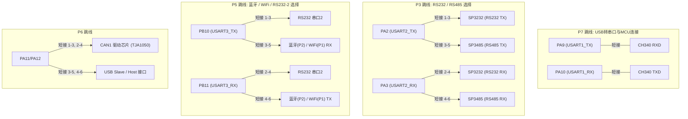

# STM32F407ZGT6 开发板硬件资源与引脚接口说明手册

---

## 目录
1. [开发板实测识别信息（在线扫描结果）](#1-开发板实测识别信息在线扫描结果)
2. [主控芯片核心规格](#2-主控芯片核心规格)
3. [板载电源与下载调试系统](#3-板载电源与下载调试系统)
4. [板载硬件模块与 GPIO 映射全表](#4-板载硬件模块与-gpio-映射全表)
5. [扩展接口与专用插座引脚定义](#5-扩展接口与专用插座引脚定义)
6. [板载跳线端子（Jumper）配置指南](#6-板载跳线端子jumper配置指南)
7. [P8 / P9 双排 60-Pin 扩展排针引脚速查表](#7-p8--p9-双排-60-pin-扩展排针引脚速查表)
8. [后续外接模块（传感器/电机/执行器）设计与接线指南](#8-后续外接模块传感器电机执行器设计与接线指南)

---

## 1. 开发板实测识别信息（在线扫描结果）

通过本机串口扫描与 STM32 ROM Bootloader 协议只读探测，实测获取到该裸板的物理硬件参数如下：

| 项目 | 实测识别值 | 详细说明 |
| :--- | :--- | :--- |
| **连接串口号** | `COM15` | 板载 CH340C USB 转串口芯片 |
| **芯片型号** | **STM32F407ZGT6** | LQFP-144 封装高性能 Cortex-M4 微控制器 |
| **芯片硬件 ID (Chip ID)** | `0x413` | ST 官方 STM32F405/407/415/417 产品族标识 |
| **芯片唯一身份码 (UID)** | `0033-0054-324D5006-20313156` | 出厂全球唯一 96-bit UID |
| **片内 Flash 容量** | `1024 KiB` (1 MB) | 512KB/1024KB 高速片内 Flash |
| **系统 Bootloader 版本** | `0x31` | ST 原厂内置系统存储器串口 ISP 引导程序 |
| **当前固件状态** | `ai-console-0.1.0` | 串口控制台就绪，支持 `USART1@115200-8N1` 字符/JSON 交互 |

---

## 2. 主控芯片核心规格

* **内核架构**：ARM 32-bit Cortex-M4 CPU with FPU（单精度浮点运算单元）+ DSP 指令集
* **主频**：最高 **168 MHz**（可达 210 DMIPS / 1.25 DMIPS/MHz）
* **存储资源**：
  * **1024 KB Flash**（片内程序存储器）
  * **192 KB SRAM**（含 128KB 系统 SRAM + 64KB CCM 紧耦合内核内存）
  * **1 MB 外部扩展 SRAM**（板载 IS62WV51216BLL，FSMC 总线直连）
  * **16 MB 外部 SPI Flash**（板载 W25Q128）
  * **256 Byte 外部 EEPROM**（板载 24C02，I2C 接口）
* **外设资源**：
  * 3 个 12 位 ADC（多达 24 通道，转换速率 2.4MSPS，三重交叉采样可达 7.2MSPS）
  * 2 个 12 位 DAC（PA4 / PA5）
  * 12 个通用定时器、2 个高级控制定时器、2 个基本定时器
  * 6 个串口（USART1~USART3, UART4~UART6）
  * 3 个 SPI、3 个 I2C、2 个 CAN 2.0B、2 个 USB（OTG FS / HS）
  * 1 个 10/100M 以太网 MAC（带硬件 IEEE 1588v2 支持）
  * 1 个 8~14 位并行摄像头接口（DCMI）
  * 1 个 4-bit SDIO 接口

---

## 3. 板载电源与下载调试系统

### 3.1 供电体系与保护
* **外部直流供电（DC IN）**：DC 5.5-2.1mm 电源插座，支持 **DC 6V ~ 24V** 宽电压输入。
* **DC-DC 稳压降压**：板载 **SY8120** 高效降压芯片，将宽压转换为稳定 `+5V (VBTN)`。
* **低压差线性稳压（LDO）**：板载 **AMS1117-3.3**，将 5V 降压为系统核心 `+3.3V`。
* **电源切换开关（K1）**：
  * 拨档 1：选择外部 DC 电源供电；
  * 拨档 2：选择 USB 端口供电（VUSB）。
* **安全保护**：
  * USB 输入端配有 **500mA 自恢复保险丝（F1）**；
  * 5V 与 3.3V 电源线路上并联 **TVS 瞬态抑制二极管（SMBJ5.0A / SMBJ3.3A）**，吸收浪涌。

### 3.2 下载与调试接口
1. **USB 一键 ISP 自动下载（USB_232 接口）**：
   * 采用 **CH340C** 芯片，通过 DTR/RTS 信号驱动 S8050/S8550 晶体管控制 `RESET` 和 `BOOT0` 引脚，无需手动拔插跳帽即可实现 FlyMcu / stm32loader 自动复位烧录。
2. **标准 JTAG / SWD 调试接口**：
   * 板载标准 20-Pin 2.54mm JTAG 插座，支持 J-Link / ST-Link / DAP-Link 仿真与硬件断点调试。
   * **SWD 最小四线连接**：`3.3V`、`GND`、`SWDIO (PA13)`、`SWCLK (PA14)`。

---

## 4. 板载硬件模块与 GPIO 映射全表

下表汇总了开发板上所有集成芯片与板载元器件的引脚分配：

| 模块类别 | 板载器件/接口 | 关键引脚 / 接口 | STM32 引脚映射 | 复用功能 / 备注 |
| :--- | :--- | :--- | :--- | :--- |
| **指示灯** | 电源指示灯 (PWR) | 3.3V 电源直连 | - | 红色 LED，通电即亮 |
| | 用户 LED0 (DS0) | LED0 | **PF9** | 低电平点亮（LED 阳极接 3.3V） |
| | 用户 LED1 (DS1) | LED1 | **PF10** | 低电平点亮（LED 阳极接 3.3V） |
| **按键输入** | 唤醒/通用按键 (WK_UP) | KEY_UP | **PA0** | 高电平有效（按下接 3.3V，带下拉） |
| | 用户按键 KEY0 | KEY0 | **PE4** | 低电平有效（按下接地，带上拉） |
| | 用户按键 KEY1 | KEY1 | **PE3** | 低电平有效（按下接地，带上拉） |
| | 用户按键 KEY2 | KEY2 | **PE2** | 低电平有效（按下接地，带上拉） |
| | 复位按键 (RESET) | NRST | **NRST (Pin 25)** | 硬件复位（按下拉低，带 100nF 滤波） |
| **蜂鸣器** | 有源蜂鸣器 (BEEP) | BEEP_CTRL | **PF8** | 高电平驱动（S8050 NPN 放大，+5V 驱动） |
| **外部 SRAM** | IS62WV51216 (1MB) | 数据总线 FSMC_D0~D15<br>地址总线 FSMC_A0~A18<br>控制线 NOE / NWE / NE3 / NBL0 / NBL1 | **PD0,1,8~10,14,15**<br>**PE0,1,7~15**<br>**PF0~5,12~15**<br>**PG0~5,10** | FSMC Bank 1 NOR/PSRAM 3 区 (0x68000000) |
| **SPI Flash** | W25Q128 (16MB) | SPI1_SCK / MISO / MOSI<br>片选 F_CS | **PB3 / PB4 / PB5**<br>**PB14** (F_CS) | 高速硬件 SPI1 (最高 42MHz) |
| **EEPROM** | AT24C02 (256B) | IIC_SCL / IIC_SDA | **PB8 / PB9** | 硬件 I2C1 或软件模拟 I2C (器件地址 0xA0) |
| **TF/MicroSD 卡** | MicroSD 卡槽 | SDIO_D0 ~ SDIO_D3<br>SDIO_SCK / SDIO_CMD | **PC8, PC9, PC10, PC11**<br>**PC12 (SCK), PD2 (CMD)** | 4-bit 模式 SDIO，支持大容量 SDHC/SDXC |
| **以太网 (ETH)** | LAN8720A PHY 芯片 | RMII 接口 (TXD0/1, RXD0/1, TX_EN, CRS_DV, MDC, MDIO, REF_CLK, RESET) | **PG13, PG14, PG11**<br>**PC4, PC5, PA7**<br>**PC1, PA2, PA1, PD3** | RMII 50MHz 时钟模式，RJ45 带网络变压器 |
| **音频 Codec** | WM8978 音频芯片 | I2S 音频总线 (LRCK, SCLK, SDOUT, SDIN, MCLK)<br>I2C 控制总线 | **PB12, PB13, PC2, PC3, PC6**<br>**PB8 (SCL), PB9 (SDA)** | 支持录音 (板载驻极体 MIC)、耳机输出、双声道功放输出 (SPK1) |
| **PWM DAC 音频** | 低通滤波音频输出 | PWM_DAC | **PA4 / PA5** | 经过 RC 双阶低通滤波后引出至 P10 排针 |
| **RS232 通信** | SP3232 芯片 | DB9 公头 / 母头 | **PA2 (TX2) / PA3 (RX2)** 或 **PB10 (TX3) / PB11 (RX3)** | 通过 P3 / P5 跳线切换路由 |
| **RS485 通信** | SP3485 芯片 | RS485_TX / RS485_RX<br>收发使能方向 RS485_RE | **PA2 / PA3 (或 PB10/PB11)**<br>**PG8** (RE/DE 高电平发，低电平收) | 板载 120Ω 差分终端电阻 |
| **CAN1 总线** | TJA1050 芯片 | CAN1_TX / CAN1_RX | **PA12 (TX) / PA11 (RX)** (或 PD1/PD0) | 5V 供电，带 120Ω 终端电阻，通过 P6 选择 |
| **CAN2 总线** | TJA1050 芯片 | CAN2_TX / CAN2_RX | **PB13 (TX) / PB12 (RX)** (或 PB6/PB5) | 5V 供电，带 120Ω 终端电阻，通过 P4 选择 |
| **USB 主/从机** | USB OTG FS | USB_DM / USB_DP | **PA11 (DM) / PA12 (DP)** | Micro-USB Slave 口与 Type-A Host 口 |
| **红外遥控接收** | HS0038 红外管 (U15) | REMOTE_IN | **PB9** (或通过定时器输入捕获) | 38kHz 载波红外解调 |
| **光敏传感器** | 光敏电阻 (LS1) | LSENS 模拟输出 | **PF8** (ADC3_IN6) | 分压电路，随光照强度改变模拟电压 |
| **电容触摸按键** | TPAD 铜箔检测电极 | TPAD | **PA5** (TIM2_CH1_ETR / TIM8_CH1N) | 充放电时间捕获测量电容变化 |
| **板载电位器** | 10K 精密可调电阻 (RJ2)| STM_ADC | **PA5** (ADC12_IN5) | 经过 P11 跳线接入 ADC 输入 |

---

## 5. 扩展接口与专用插座引脚定义

### 5.1 TFT LCD 液晶屏接口（P15 - 34 Pin 插座）
兼容市面上 2.8 / 3.2 / 3.5 / 4.3 / 7.0 寸 8080 并口触摸屏模块：

```text
       ┌───────────────────────────────┐
LCD_CS │ 1   PG12 (FSMC_NE4)   2  PF12 │ RS (FSMC_A6)
LCD_WR │ 3   PD5  (FSMC_NWE)   4  PD4  │ RD (FSMC_NOE)
 RESET │ 5   NRST (System RST) 6  PD14 │ DB0 (FSMC_D0)
   DB1 │ 7   PD15 (FSMC_D1)    8  PD0  │ DB2 (FSMC_D2)
   DB3 │ 9   PD1  (FSMC_D3)   10  PE7  │ DB4 (FSMC_D4)
   DB5 │ 11  PE8  (FSMC_D5)   12  PE9  │ DB6 (FSMC_D6)
   DB7 │ 13  PE10 (FSMC_D7)   14  PE11 │ DB8 (FSMC_D8)
   DB9 │ 15  PE12 (FSMC_D9)   16  PE13 │ DB10 (FSMC_D10)
  DB11 │ 17  PE14 (FSMC_D11)  18  PE15 │ DB12 (FSMC_D12)
  DB13 │ 19  PD8  (FSMC_D13)  20  PD9  │ DB14 (FSMC_D14)
  DB15 │ 21  PD10 (FSMC_D15)  22  GND  │ Power Ground
LCD_BL │ 23  PB15 (Backlight) 24  3.3V │ VDD 3.3V
  3.3V │ 25  VDD 3.3V         26  GND  │ Power Ground
   GND │ 27  Power Ground     28  +5V  │ BL_VDD (+5V 背光电源)
T_MISO │ 29  PB2  (Touch MISO)30  PF11 │ T_MOSI (Touch MOSI)
 T_PEN │ 31  PB1  (Touch IRQ) 32  PB2  │ T_MISO
  T_CS │ 33  PC13 (Touch CS)  34  PB0  │ T_SCK (Touch SCK)
       └───────────────────────────────┘
```

### 5.2 摄像头模块接口（P12 - 18 Pin DCMI 插座）
支持 OV7670 / OV2640 / OV5640 等摄像头：

| 引脚 | 信号名称 | MCU 引脚 | 引脚 | 信号名称 | MCU 引脚 |
| :---: | :--- | :--- | :---: | :--- | :--- |
| **1** | +3.3V 供电 | 3.3V | **2** | GND 接地 | GND |
| **3** | DCMI_VSYNC (帧同步) | **PB7** | **4** | DCMI_HREF (行同步) | **PA4** |
| **5** | DCMI_PCLK (像素时钟) | **PA6** | **6** | DCMI_XCLK (外部时钟) | **PA8** |
| **7** | DCMI_D7 (数据 7) | **PE6** | **8** | DCMI_D6 (数据 6) | **PE5** |
| **9** | DCMI_D5 (数据 5) | **PB6** | **10** | DCMI_D4 (数据 4) | **PC11** |
| **11** | DCMI_D3 (数据 3) | **PC9** | **12** | DCMI_D2 (数据 2) | **PC8** |
| **13** | DCMI_D1 (数据 1) | **PC7** | **14** | DCMI_D0 (数据 0) | **PC6** |
| **15** | DCMI_RESET (复位) | **PG15** | **16** | DCMI_PWDN (掉电控制)| **PG9** |
| **17** | SCCB_SCL (I2C 时钟) | **PB8** | **18** | SCCB_SDA (I2C 数据) | **PB9** |

### 5.3 NRF24L01 2.4G 无线模块接口（P13 - 8 Pin 插座）
| 引脚编号 | 引脚名称 | STM32 引脚 | 功能说明 |
| :---: | :--- | :--- | :--- |
| **1** | GND | GND | 电源地 |
| **2** | VCC | +3.3V | 电源正极 (3.3V，禁止接 5V) |
| **3** | CE | **PG6** | 芯片使能发射/接收控制 |
| **4** | CSN | **PG7** | SPI 片选使能（低有效） |
| **5** | SCK | **PB3** (SPI1_SCK) | SPI 时钟 |
| **6** | MOSI | **PB5** (SPI1_MOSI)| SPI 主机输出 |
| **7** | MISO | **PB4** (SPI1_MISO)| SPI 主机输入 |
| **8** | IRQ | **PG8** (NRF_IRQ) | 中断请求输出（低有效） |

### 5.4 ESP-01 WiFi 模块接口（P1 - 8 Pin 插座）
* **1 (RXD)**：接串口 TXD（通过 P5 跳线选择 USART3_TX / PB10）
* **2 (VCC)**：+3.3V
* **3 (GPIO0)**：悬空或上拉（正常运行模式）
* **4 (RST)**：复位引脚
* **5 (GPIO2)**：悬空
* **6 (CH_PD)**：使能脚（接 3.3V 高电平使能）
* **7 (GND)**：电源地
* **8 (TXD)**：接串口 RXD（通过 P5 跳线选择 USART3_RX / PB11）

### 5.5 HC-05 蓝牙透传模块接口（P2 - 6 Pin 单排插座）
* **Pin 1 (STATE)**：状态指示脚
* **Pin 2 (RXD)**：接 MCU TXD（通过 P5 跳线连接）
* **Pin 3 (TXD)**：接 MCU RXD（通过 P5 跳线连接）
* **Pin 4 (GND)**：电源地
* **Pin 5 (VCC)**：+5V 供电
* **Pin 6 (EN / KEY)**：AT 模式配置使能脚

### 5.6 单总线温湿度传感器接口（P14 - 4 Pin 单排插座）
支持 DHT11 / DS18B20 / DHT22：
* **Pin 1 (VDD)**：+3.3V
* **Pin 2 (DATA)**：**PG9**（板载 4.7K 上拉电阻 R69）
* **Pin 3 (NC)**：空脚
* **Pin 4 (GND)**：电源地

---

## 6. 板载跳线端子（Jumper）配置指南

开发板上设置了多组多功能复用跳线，使用对应外设时需确保跳帽正确短接：



### 详细跳线状态速查：
1. **P7（USART1 通信跳线）**：
   * 必须用两个跳帽分别短接 **1-3** 和 **2-4**，使板载 CH340C 连接到 STM32 的 `PA9/PA10`，方可在电脑端通过 COM 端口查看日志与 ISP 烧录。
2. **P3（USART2 / RS232 / RS485 选择）**：
   * 短接 **1-3, 2-4**：PA2/PA3 接入 SP3232 芯片，启用 **RS232 (COM_M/G)**。
   * 短接 **3-5, 4-6**：PA2/PA3 接入 SP3485 芯片，启用 **RS485 绿色接线端子**。
3. **P5（USART3 / 蓝牙 / WiFi 选择）**：
   * 短接 **1-3, 2-4**：PB10/PB11 接入 SP3232 第二路串口。
   * 短接 **3-5, 4-6**：PB10/PB11 接入 **P1 (ESP-01 WiFi)** 或 **P2 (HC-05 蓝牙)** 插座。
4. **P6（CAN1 / USB OTG 选择）**：
   * 短接 **1-3, 2-4**：PA11/PA12 接入 TJA1050 芯片，启用 **CAN1 绿色接线柱**。
   * 短接 **3-5, 4-6**：PA11/PA12 接入 **USB Slave / USB Host 接口**。
5. **P4（CAN2 跳线）**：
   * 短接 **1-2, 3-4**：PB12/PB13 接入第二路 TJA1050 芯片，启用 **CAN2 绿色接线柱**。
6. **P11（ADC/DAC 与电位器选择）**：
   * 短接 **1-3**：将 TPAD 触摸引脚连通；
   * 短接 **3-4**：将板载 10K 电位器输出接入 `PA5 (STM_ADC)` 进行可调电压采样；
   * 短接 **5-6**：将 `PA4 (STM_DAC)` 模拟量引出至测试端。
7. **P10（PWM DAC 音频跳线）**：
   * 短接后将 PA4/PA5 经 RC 滤波生成的音频信号送入音频输出端。

---

## 7. P8 / P9 双排 60-Pin 扩展排针引脚速查表

开发板左右两侧引出了两排 2x30（共 120 个）2.54mm 标准排针，引出了 MCU 绝大部分尚未被专用外设独占的引脚，方便用杜邦线外接传感器。

### 7.1 P9 扩展排针引脚定义（左侧/上侧）

| 奇数引脚 | 信号/网络名 | 复用/通用功能 | 偶数引脚 | 信号/网络名 | 复用/通用功能 |
| :---: | :--- | :--- | :---: | :--- | :--- |
| **1** | **PF14** | FSMC_A8 / GPIO | **2** | **PF15** | FSMC_A9 / GPIO |
| **3** | **PG0** | FSMC_A10 / GPIO | **4** | **PG1** | FSMC_A11 / GPIO |
| **5** | **PG2** | FSMC_A12 / GPIO | **6** | **PG3** | FSMC_A13 / GPIO |
| **7** | **PG4** | FSMC_A14 / GPIO | **8** | **PG5** | FSMC_A15 / GPIO |
| **9** | **PD11** | FSMC_A16 / USART3_CTS | **10** | **PE11** | FSMC_D8 / TIM1_CH2 |
| **11** | **PE12** | FSMC_D9 / TIM1_CH3N | **12** | **PE13** | FSMC_D10 / TIM1_CH3 |
| **13** | **PE10** | FSMC_D7 / TIM1_CH2N | **14** | **PE9** | FSMC_D6 / TIM1_CH1 |
| **15** | **PE8** | FSMC_D5 / TIM1_CH1N | **16** | **PE7** | FSMC_D4 / TIM1_ETR |
| **17** | **PF13** | FSMC_A7 / GPIO | **18** | **PF12** | FSMC_A6 / LCD_RS |
| **19** | **PD1** | FSMC_D3 / CAN1_TX | **20** | **PD0** | FSMC_D2 / CAN1_RX |
| **21** | **PD15** | FSMC_D1 / TIM4_CH4 | **22** | **PD14** | FSMC_D0 / TIM4_CH3 |
| **23** | **PG10** | FSMC_NE3 / GPIO | **24** | **PF0** | FSMC_A0 / I2C2_SDA |
| **25** | **PF1** | FSMC_A1 / I2C2_SCL | **26** | **PF2** | FSMC_A2 / I2C2_SMBA |
| **27** | **PF3** | FSMC_A3 / ADC3_IN9 | **28** | **PF4** | FSMC_A4 / ADC3_IN14 |
| **29** | **PB11** | USART3_RX / ETH_TX_EN | **30** | **PB10** | USART3_TX / I2C2_SCL |
| **31** | **PB2** | BOOT1 / Touch MISO | **32** | **PB1** | TIM3_CH4 / Touch PEN |
| **33** | **PB0** | TIM3_CH3 / Touch SCK | **34** | **PA3** | USART2_RX / TIM2_CH4 |
| **35** | **PA4** | DAC1_OUT / SPI1_NSS | **36** | **PA2** | USART2_TX / TIM2_CH3 |
| **37** | **PC0** | ADC123_IN10 / GPIO | **38** | **PA0** | WK_UP / TIM2_CH1 / ADC123_IN0 |
| **39** | **VDDA** | 模拟参考电压正 (3.3V) | **40** | **VREF+** | ADC 参考电压正 |
| **41** | **RESET** | 系统复位端 (NRST) | **42** | **PF10** | 板载 LED1 / ADC3_IN8 |
| **43** | **PF9** | 板载 LED0 / TIM14_CH1 | **44** | **PC13** | RTC_AF1 / Touch CS |
| **45** | **VBAT** | 纽扣电池供电端 | **46** | **PE5** | KEY2 / DCMI_D6 / TIM9_CH1 |
| **47** | **PE4** | KEY0 / DCMI_D4 | **48** | **PE3** | KEY1 / TRACED0 |
| **49** | **PE2** | KEY2 / TRACECLK | **50** | **PF6** | TIM10_CH1 / ADC3_IN4 |
| **51** | **PA5** | DAC2_OUT / ADC12_IN5 / TPAD | **52** | **PE1** | FSMC_NBL1 / DCMI_D3 |
| **53** | **PE0** | FSMC_NBL0 / TIM4_ETR | **54** | **PF5** | FSMC_A5 / ADC3_IN15 |
| **55** | **GND** | 电源地 | **56** | **GND** | 电源地 |
| **57** | **+5V** | 5V 系统电源 | **58** | **+5V** | 5V 系统电源 |
| **59** | **+3.3V** | 3.3V 系统电源 | **60** | **+3.3V** | 3.3V 系统电源 |

---

### 7.2 P8 扩展排针引脚定义（右侧/下侧）

| 奇数引脚 | 信号/网络名 | 复用/通用功能 | 偶数引脚 | 信号/网络名 | 复用/通用功能 |
| :---: | :--- | :--- | :---: | :--- | :--- |
| **1** | **PE15** | FSMC_D12 / TIM1_BKIN | **2** | **PE14** | FSMC_D11 / TIM1_CH4 |
| **3** | **PD9** | FSMC_D14 / USART3_RX | **4** | **PD8** | FSMC_D13 / USART3_TX |
| **5** | **PF5** | FSMC_A5 / ADC3_IN15 | **6** | **PD10** | FSMC_D15 / USART3_CK |
| **7** | **PB12** | CAN2_RX / SPI2_NSS | **8** | **PD4** | FSMC_NOE / USART2_RTS |
| **9** | **PB14** | SPI2_MISO / TIM12_CH1 | **10** | **PB13** | SPI2_SCK / CAN2_TX |
| **11** | **PG12** | FSMC_NE4 / LCD_CS | **12** | **PB15** | SPI2_MOSI / LCD_BL |
| **13** | **PC4** | ETH_RXD0 / ADC12_IN14 | **14** | **PC5** | ETH_RXD1 / ADC12_IN15 |
| **15** | **PA1** | ETH_REF_CLK / TIM2_CH2 | **16** | **PA7** | SPI1_MOSI / TIM3_CH2 |
| **17** | **PG14** | ETH_TXD1 / USART6_TX | **18** | **PC1** | ETH_MDC / ADC123_IN11 |
| **19** | **PG11** | ETH_TX_EN / GPIO | **20** | **PG13** | ETH_TXD0 / USART6_CTS |
| **21** | **PC3** | SPI2_MOSI / ADC123_IN13 | **22** | **PD3** | ETH_RESET / USART2_CTS |
| **23** | **PC6** | DCMI_D0 / TIM3_CH1 / I2S2_MCK | **24** | **PC2** | SPI2_MISO / ADC123_IN12 |
| **25** | **PC8** | SDIO_D0 / TIM3_CH3 | **26** | **PC7** | SDIO_D7 / TIM3_CH2 |
| **27** | **PA8** | DCMI_XCLK / TIM1_CH1 / MCO1 | **28** | **PC9** | SDIO_D1 / TIM3_CH4 |
| **29** | **PA10** | USART1_RX / TIM1_CH3 | **30** | **PA9** | USART1_TX / TIM1_CH2 |
| **31** | **PA12** | CAN1_TX / USB_DP | **32** | **PA11** | CAN1_RX / USB_DM |
| **33** | **PA14** | JTAG_TCK / SWD_SWCLK | **34** | **PA13** | JTAG_TMS / SWD_SWDIO |
| **35** | **PC10** | SDIO_D2 / SPI3_SCK / UART4_TX | **36** | **PA15** | JTAG_TDI / TIM2_CH1 |
| **37** | **PC12** | SDIO_CLK / SPI3_MOSI / UART5_TX| **38** | **PC11** | SDIO_D3 / SPI3_MISO / UART4_RX|
| **39** | **PD6** | FSMC_NWAIT / USART2_RX | **40** | **PD2** | SDIO_CMD / TIM3_ETR / UART5_RX |
| **41** | **PG9** | FSMC_NE2 / 1WIRE_DQ / DCMI_PWDN | **42** | **PD7** | FSMC_NE1 / USART2_CK |
| **43** | **PB3** | JTAG_TDO / SPI1_SCK | **44** | **PG15** | DCMI_RESET / USART6_CTS |
| **45** | **PB5** | SPI1_MOSI / CAN2_RX | **46** | **PB4** | JTAG_TRST / SPI1_MISO |
| **47** | **PB7** | I2C1_SDA / DCMI_VSYNC / TIM4_CH2 | **48** | **PB6** | I2C1_SCL / DCMI_D5 / TIM4_CH1 |
| **49** | **PB8** | I2C1_SCL / CAN1_RX / TIM4_CH3 | **50** | **BOOT0**| BOOT0 启动模式控制端 |
| **51** | **PA6** | DCMI_PCLK / TIM3_CH1 / ADC12_IN6| **52** | **PB9** | I2C1_SDA / CAN1_TX / TIM4_CH4 |
| **53** | **PE6** | DCMI_D7 / TIM9_CH2 | **54** | **PF8** | BEEP / 光敏 LSENS / TIM13_CH1 |
| **55** | **PG8** | RS485_RE / NRF_IRQ | **56** | **PF7** | TIM11_CH1 / ADC3_IN5 |
| **57** | **PG7** | NRF_CS / FSMC_INT3 | **58** | **PG6** | NRF_CE / FSMC_INT2 |
| **59** | **GND** | 电源地 | **60** | **+3.3V** | 3.3V 系统电源 |

---

## 8. 后续外接模块（传感器/电机/执行器）设计与接线指南

针对后期项目中即将引入的各类传感器与执行器，提供标准接线与引脚推荐配置：

### 8.1 0.96寸 I2C / SPI OLED 显示屏
* **I2C 接口 OLED（推荐接线）**：
  * `VCC` -> 开发板 **3.3V**
  * `GND` -> 开发板 **GND**
  * `SCL` -> **PB8**（或任意 GPIO 模拟 I2C）
  * `SDA` -> **PB9**（或任意 GPIO 模拟 I2C）
* **SPI 接口 OLED（4 线 / 7 线）**：
  * `D0 (CLK)` -> **PB3 (SPI1_SCK)** 或通用 GPIO
  * `D1 (MOSI)` -> **PB5 (SPI1_MOSI)** 或通用 GPIO
  * `RES` -> **PD0**（通用输出）
  * `DC` -> **PD1**（通用输出）
  * `CS` -> **PD2**（通用输出）

### 8.2 舵机（SG90 / MG995 / MG996R）
> [!WARNING]
> **绝对严禁直接使用 STM32 开发板的 3.3V 或 5V 引脚给舵机供电！**
> 舵机启动和堵转电流达 0.8A~2.5A，直连会导致 LDO 烧毁或单片机反复复位。

* **标准接线方案**：
  * **棕色 / 黑色（GND）** -> 接**外部 5V/6V 电源负极**，**并务必用导线与 STM32 开发板的 GND 共地**；
  * **红色（VCC）** -> 接**外部独立 5V/6V 电源正极**；
  * **橙色 / 黄色（PWM 信号线）** -> 直连 STM32 定时器 PWM 引脚（如 **PA0 / TIM2_CH1** 或 **PA1 / TIM2_CH2** 或 **PA2 / TIM2_CH3**）。

### 8.3 直流减速电机（MG310 霍尔版 轴径3mm）+ TB6612 双路驱动稳压版
* **供电与使能**：
  * 外部电源：**2S 7.4V 动力锂电池组**接驱动板 `VM` 与 `GND` 输入；
  * 开发板供电：驱动板板载降压稳压 `5V` 输出接开发板 **+5V**（P9 Pin 57/58），**开发板 GND 必须与驱动板 GND 严格共地**（P9 Pin 55/56）；
  * `STBY` -> 接开发板 **+3.3V**（常开使能）或 **PD3**（GPIO 软件待机控制）；
* **电机 A 控制与编码器反馈**：
  * `PWMA` -> **PA0**（P9 Pin 38，复用 **TIM5_CH1** 或 **TIM2_CH1**，10kHz PWM 调速）；
  * `AIN1 / AIN2` -> **PE0 / PE1**（P9 Pin 53/52，方向控制：10正转，01反转，00刹车）；
  * 编码器反馈 `E1A / E1B` -> **PB6 / PB7**（P8 Pin 48/47，复用 **TIM4_CH1 / CH2** 正交编码器接口，单圈 1040 脉冲）；
  * 驱动端子 `AO1 / AO2` -> 接入 MG310 电机 A 的 6P 排线插座；
* **电机 B 控制与编码器反馈**：
  * `PWMB` -> **PA1**（P8 Pin 15，复用 **TIM5_CH2** 或 **TIM2_CH2**，10kHz PWM 调速）；
  * `BIN1 / BIN2` -> **PE2 / PE3**（P9 Pin 49/48，方向控制）；
  * 编码器反馈 `E2A / E2B` -> **PC6 / PC7**（P8 Pin 23/26，复用 **TIM3_CH1 / CH2** 正交编码器接口）；
  * 驱动端子 `BO1 / BO2` -> 接入 MG310 电机 B 的 6P 排线插座；
* **动力电池电压监控 (ADC)**：
  * 驱动板 `ADC` -> **PA6**（P8 Pin 51，ADC1_IN6 采样 1/11 分压，换算公式：输入电压 = 采样值 * 3.3 * 11 / 4096）。

### 8.4 HC-SR04 超声波测距模块
* `VCC` -> 开发板 **5V**
* `GND` -> 开发板 **GND**
* `Trig (触发脚)` -> **PE14**（MCU 普通 GPIO 推挽输出，给 10μs 高电平脉冲）
* `Echo (回响脚)` -> **PA6 (TIM3_CH1)** 或 **PE15**（带 5V 容忍的定时器输入捕获通道，测量高电平持续时间）

### 8.5 串口蓝牙 / 外部无线透传模块
* 可直接插在板载 **P2 (HC-05 专用插座)** 上，跳线 **P5 短接 3-5、4-6**，即可使用 **USART3 (PB10/PB11)** 与手机进行双向无线通信。

---

## 9. 总结与开发建议

1. **核心通信测试**：目前裸板上已部署并验证通过基础固件，通过 `COM15 (115200 8N1)` 发送 `ping`、`info`、`status`、`led set on/off` 可随时验证主控状态及板载指示灯。
2. **下载与调试**：日常开发可直接通过 USB 口配合 FlyMcu / Keil 自动 ISP 下载，或使用 J-Link / ST-Link 连接 JTAG/SWD 接口进行源码级单步断点调试。
3. **扩展规范**：外接大功率模块（电机、舵机、继电器、大功率射频）时，请严格执行**“独立供电、信号直连、严格共地”**的三原则，防止烧片。
