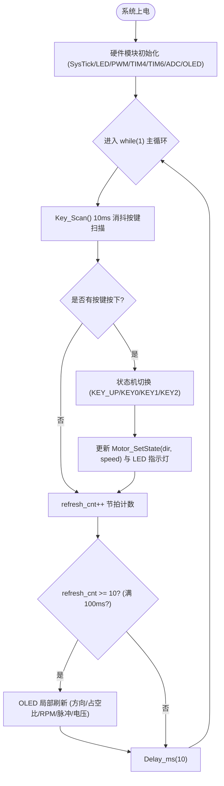

# 🚀 STM32F407 电机调速与测速监控工程：小白从零进阶精讲

> **工程本地路径**：[`E:\stm32\PWM_LED`](file:///E:/stm32/PWM_LED)  
> **代码仓库归档**：[`homework/Motor_Encoder_OLED_Monitor/`](Motor_Encoder_OLED_Monitor/)  
> **面向读者**：刚接触 STM32、定时器、PWM、编码器测速和 ADC 的嵌入式初学者 / 小白  
> **核心硬件**：STM32F407ZGT6 开发板、TB6612FNG 调压驱动模块、MG310 霍尔直流减速电机、0.96 寸 I2C OLED、7.4V 锂电池组  
> **编写者**：Serendipity

---

## 目录
- [一、 写在前面：小白必懂的基础认知](#一-写在前面小白必懂的基础认知)
- [二、 系统硬件全景接线图与安全红线](#二-系统硬件全景接线图与安全红线)
- [三、 模块一：PWM 电机调速是怎么实现的？(pwm.c)](#三-模块一pwm-电机调速是怎么实现的pwmc)
- [四、 模块二：电机正反转与制动急停怎么控制？(pwm.c)](#四-模块二电机正反转与制动急停怎么控制pwmc)
- [五、 模块三：编码器 4 倍频与高精度测速推导 (encoder.c & timer.c)](#五-模块三编码器-4-倍频与高精度测速推导-encoderc--timerc)
- [六、 模块四：ADC 电池电压采样计算与避坑指南 (adc.c)](#六-模块四adc-电池电压采样计算与避坑指南-adcc)
- [七、 模块五：按键状态机与 OLED 实时刷新架构 (main.c)](#七-模块五按键状态机与-oled-实时刷新架构-mainc)
- [八、 常见疑问与避坑问答 (Q&A)](#八-常见疑问与避坑问答-qa)

---

## 一、 写在前面：小白必懂的基础认知

### 1.1 为什么单片机引脚不能直接插在电机上？
很多刚入门的同学会问：“单片机的引脚能输出 3.3V 高电平，为什么不直接把电机的正负极插在单片机引脚上转动？”
* **驱动电流不够**：STM32 单个 GPIO 引脚的最大输出电流仅为 **25 mA**（毫安），而哪怕是一台小型 MG310 直流电机，空载运转电流通常在 **150 mA ~ 300 mA**，堵转或启动瞬间更是高达 **1A ~ 2A**（1000 mA ~ 2000 mA）以上！
* **击穿烧毁芯片**：如果直接插上，轻则单片机内部电源保护复位，重则瞬间烧毁 GPIO 输出级推挽 MOS 管，甚至报废整颗芯片。
* **解决方案**：引入**电机驱动芯片（如 TB6612FNG）**。单片机只负责发出“微弱的控制信号（PWM 和高低电平）”，驱动芯片负责将“强劲的外部动力电源（7.4V 锂电池）”导入电机。单片机相当于“驾驶员”，TB6612 驱动芯片相当于“发动机与变速箱”。

### 1.2 这个系统最终能做到什么？
1. **按键调速**：通过 `KEY_UP` 和 `KEY0`，以 10% 为步长随意调节电机速度（0% ~ 100%）。
2. **双向切换与刹车**：通过 `KEY1` 控制正转/刹车，`KEY2` 控制反转/刹车，并有板载 LED0/LED1 指示运转状态。
3. **真实速度测量**：单片机利用硬件定时器解码电机屁股后面的霍尔编码器，实时测算出转轴的每分钟实际转速（RPM）。
4. **母线电压监测**：测量当前动力电池剩余电压（V），电量不足一目了然。
5. **实时屏幕显示**：把方向、设定速度百分比、实际 RPM、脉冲数、母线电压清晰地打印在 0.96 寸 OLED 上。

---

## 二、 系统硬件全景接线图与安全红线

为了让大家少走弯路，以下是经过严密验证的最优引脚分配表：

| 外设模块 | 端子名称 | STM32F407 引脚 | 排针物理编号 | 引脚模式 / 功能 | 小白避坑必读说明 |
| :--- | :--- | :--- | :--- | :--- | :--- |
| **TB6612 驱动板** | **PWMA** | **PB1** | P8 Pin 35 | TIM3_CH4 复用推挽 | 10kHz 硬件 PWM 脉冲输出 |
| | **PWMB** | **PB0** | P8 Pin 36 | TIM3_CH3 复用推挽 | 同步调速输出（预留双电机） |
| | **AIN1** | **PE0** | P9 Pin 53 | GPIO 推挽输出 | 控制转向 1（远离板载 SPI Flash 片选 PB14） |
| | **AIN2** | **PE1** | P9 Pin 52 | GPIO 推挽输出 | 控制转向 2（远离板载 LCD 背光引脚 PB15） |
| | **STBY** | **+3.3V** | P9 Pin 59 | 常接高电平 | 驱动芯片开启使能端 |
| | **GND** | **GND** | P9 Pin 55/56 | 公共参考地 | **【生命线】动力电池负极、驱动板与单片机严格单点共地** |
| | **ADC** | **PA5** *(首选)* / **PA6** | P9 Pin 51 / P8 Pin 39 | ADC1_IN5 / IN6 模拟输入 | 采集 1/11 分压后的母线电压 |
| **MG310 编码器** | **E2A (A相)** | **PB6** | P8 Pin 38 | TIM4_CH1 复用上拉 | 霍尔方波 A 相输入 |
| | **E2B (B相)** | **PB7** | P8 Pin 37 | TIM4_CH2 复用上拉 | 霍尔方波 B 相输入 |
| | **VCC** | **+5V** | P9 Pin 57/58 | 传感器供电 | 霍尔传感器建议使用 5V 供电 |
| | **GND** | **GND** | P9 Pin 55/56 | 传感器地 | 接系统公共地 |
| **0.96寸 OLED** | **SCL** | **PB8** | P8 Pin 33 | 开漏/推挽输出 | 软件模拟 I2C 时钟线 |
| | **SDA** | **PB9** | P8 Pin 34 | 开漏/推挽输出 | 软件模拟 I2C 数据线 |
| | **VCC** | **+3.3V** | P9 Pin 59 | 逻辑供电 | 供电必须稳定 3.3V |
| | **GND** | **GND** | P9 Pin 55/56 | 逻辑地 | 接系统公共地 |

> **⚠️ 小白三大安全红线**：
> 1. **严禁直接向单片机输入动力电**：7.4V 动力电池正极只能接在驱动板的 `VM` 端子上，绝对不能插到开发板的 `3.3V` 或 `5V` 引脚上，插错单片机瞬间烧毁！
> 2. **必须统一共地（GND）**：单片机、驱动板和编码器的地线必须连在一起。如果没连在一起，单片机发出的 3.3V 信号在驱动板看来根本没有参考标准，电机将发疯乱转或完全无响应。
> 3. **避开 P8 Pin 50（BOOT0）**：在插拔 P8 扩展排针时，注意切勿让跳线金属碰触到 Pin 50，否则复位时会误入 ROM 串口下载模式导致单片机“假死”。

---

## 三、 模块一：PWM 电机调速是怎么实现的？(pwm.c)

### 3.1 什么是 PWM？用“极速开关水龙头”打比方
* **直流电机调速的本质**：改变加在电机两端的**平均有效电压**。如果给 7.4V，电机全速飞转；给 3.7V，电机半速旋转。
* 但单片机输出只有“0V（低电平）”和“3.3V（高电平）”，怎么输出 1.65V 或 50% 呢？
* **PWM（脉冲宽度调制，Pulse Width Modulation）**：想象你在一秒钟内把水龙头开关了 10,000 次！
  - 如果开的时间占 50%，关的时间占 50%，流出来的水相当于一半；
  - 高电平时间占整个周期的比例，叫做**占空比（Duty Cycle）**；
  - 占空比 50%，电机感受到的就是一半的能量；占空比 100%，就是全开；占空比 0%，就是全关。

### 3.2 STM32F407 的 10kHz 频率是怎么计算出来的？
* **为什么选 10kHz？**
  - 如果 PWM 频率只有 100Hz ~ 1kHz，电机会像扩音喇叭一样发出刺耳尖锐的“滋滋”蜂鸣声；
  - 如果 PWM 频率超过 20kHz ~ 50kHz，MOS 开关损耗大，驱动板发热剧烈；
  - **10kHz ~ 20kHz** 是电机驱动的黄金区间，兼顾静音与驱动效率。
* **时钟树的秘密（APB1 定时器倍频）**：
  - STM32F407 的主频为 168MHz；
  - 定时器 TIM3 挂载在 **APB1 总线**上。系统给 APB1 的分频系数是 4，所以 APB1 的外设时钟是 42MHz；
  - 但是 STM32 硬件规定：如果 APB 预分频器不为 1，则送给定时器的时钟会自动 **×2 倍频**！
  - 因此，TIM3 的时钟源频率实际是：
    $$f_{\text{TIM3CLK}} = 42\text{ MHz} \times 2 = 84\text{ MHz} = 84\,000\,000\text{ Hz}$$
* **定时器核心计数公式**：
  $$f_{\text{PWM}} = \frac{f_{\text{TIM3CLK}}}{(\text{PSC} + 1) \times (\text{ARR} + 1)}$$
  我们让预分频器 `PSC = 0`（不分频，计数时钟就是 84MHz）。
  要求 $f_{\text{PWM}} = 10\,000\text{ Hz}$，则：
  $$\text{ARR} + 1 = \frac{84\,000\,000}{10\,000} = 8400 \implies \text{ARR} = 8399$$
* **占空比换算逻辑**：
  - 计数器从 0 数到 8399，总共 8400 个点；
  - 设定速度百分比 `speed_percent` 范围为 `0 ~ 100`；
  - 那么比较寄存器 CCR 的值就是：
    $$\text{CompareVal} = \text{SpeedPercent} \times 84$$
  - 当速度为 50% 时，`CCR = 50 * 84 = 4200`，输出一半高电平一半低电平（50% 占空比）；
  - 当速度为 100% 时，`CCR = 8400`，输出 100% 满占空比。

```c
// pwm.c 中的实际代码实现
void Motor_SetSpeed(uint16_t speed_percent)
{
    uint16_t compare_val = 0;
    if (speed_percent > 100) speed_percent = 100;
    compare_val = (uint16_t)(speed_percent * 84); // 8400 / 100 = 84

    TIM_SetCompare4(TIM3, compare_val); // 设置 PWMA (PB1)
    TIM_SetCompare3(TIM3, compare_val); // 设置 PWMB (PB0)
}
```

---

## 四、 模块二：电机正反转与制动急停怎么控制？(pwm.c)

### 4.1 TB6612 驱动逻辑真值表
TB6612 芯片通过两个逻辑脚（AIN1、AIN2）来决定电机的动作：

| AIN1 | AIN2 | PWM 信号 | 电机状态 | 实际物理表现 | 为什么？ |
| :---: | :---: | :---: | :---: | :---: | :--- |
| **0** | **1** | 有脉冲 | **正转 (CW)** | 电机正向运转，转速取决于占空比 | 电流从 A02 流向 A01 |
| **1** | **0** | 有脉冲 | **反转 (CCW)**| 电机反向运转，转速取决于占空比 | 电流从 A01 流向 A02 |
| **1** | **1** | 任意 | **短路制动 (Brake)**| **瞬间刹车急停！** | H 桥下臂全部导通，电机变成发电机自短路产生反向阻尼力 |
| **0** | **0** | 任意 | **滑行停机 (Coast)**| 慢慢依靠摩擦力滑行停止 | H 桥输出全部高阻断开，电机自由滑行 |

> **💡 小白核心要点**：
> 很多初学者写停车时直接把 PWM 设置为 0，这叫“滑行停止”，小车靠惯性还会继续滑很远！
> 我们的代码中实现了专门的 `Motor_Stop()` 函数，将 `AIN1 = 1; AIN2 = 1;`，启动硬件短路刹车，电机瞬间锁死急停，稳准狠！

```c
// pwm.c 中的急停刹车代码
void Motor_Stop(void)
{
    /* 1. 先将 PWM 占空比清零 */
    Motor_SetSpeed(0);

    /* 2. AIN1 = 1, AIN2 = 1: TB6612 硬件短路制动模式 (Short Brake) */
    GPIO_SetBits(GPIOE, GPIO_Pin_0);
    GPIO_SetBits(GPIOE, GPIO_Pin_1);
}
```

---

## 五、 模块三：编码器 4 倍频与高精度测速推导 (encoder.c & timer.c)

### 5.1 什么是霍尔编码器？
* 电机尾部装有一片带磁极的圆形磁环，旁边立着两个霍尔传感器元件（A相与 B相）。
* 当电机旋转时，磁铁扫过霍尔传感器，A相与 B相会分别输出两路相位相差 90° 的方波脉冲。
* 如果 A 相脉冲超前 B 相，说明电机在**正转**；如果 B 相超前 A 相，说明电机在**反转**。

### 5.2 为什么 TIM4 硬件编码器接口可以 4 倍频？
* 如果只检测 A 相的上升沿，一个周期只能计数 1 次；
* STM32 定时器拥有专用的**编码器接口模式（TIM_EncoderMode_TI12）**：
  - A 相的上升沿计一次数、下降沿再计一次数（2 次）；
  - B 相的上升沿计一次数、下降沿再计一次数（2 次）；
  - **一个方波周期总共计数 4 次**！
* 这样一来，不增加任何硬件成本，直接将转速测量的分辨率与灵敏度**提高了整整 4 倍**！

### 5.3 减速电机输出轴转一圈到底多少个脉冲？（关键数学推导）
我们使用的是常见的 **MG310 减速电机**：
1. 内部转子自带 13 线霍尔磁极（即转子转 1 圈，A/B 相各输出 13 个周期方波）；
2. 经过 TIM4 硬件 4 倍频后，**转子内部每转 1 圈计数**：
   $$P_{\text{rotor}} = 13 \times 4 = 52\text{ 个脉冲}$$
3. 电机前端带有 1:20 的全金属减速齿轮箱（转子转 20 圈，外部输出轴才转 1 圈）。
4. **外部输出轴每转 1 圈产生的总脉冲数**：
   $$P_{\text{shaft}} = 52 \times 20 = 1040\text{ 个脉冲}$$

### 5.4 转速 RPM 怎么算？（纯整型纳秒级算法）
我们配置定时器 TIM6，每隔 **100ms（即 0.1 秒）** 产生一次定时中断：
1. 在中断到来的瞬间，读取当前 TIM4 计数值 `count`，并**立刻将 TIM4 计数器清零**，以便下一个 100ms 重新累加。
2. 在 0.1 秒内转了多少圈？
   $$\text{圈数} = \frac{\text{count}}{1040}$$
3. 每秒转数（RPS）：
   $$\text{RPS} = \frac{\text{圈数}}{0.1\text{s}} = \frac{\text{count}}{1040 \times 0.1} = \frac{\text{count}}{104}$$
4. 每分钟转数（RPM）：
   $$\text{RPM} = \text{RPS} \times 60 = \frac{\text{count} \times 60}{104} = \frac{\text{count} \times 600}{1040}$$
   分子分母同时约去公约数 40：
   $$\text{RPM} = \frac{\text{count} \times 15}{26}$$

```c
// encoder.c 中的 100ms 中断核心算法
void Encoder_100ms_Update(void)
{
    /* 1. 差分读取：读取 100ms 内累积的脉冲数，随后清零重新计数 */
    int16_t count = (int16_t)TIM_GetCounter(TIM4);
    TIM_SetCounter(TIM4, 0);
    s_encoder_count = count;

    /* 2. 纯整型高精度快速换算 */
    int32_t rpm = (int32_t)count * 15 / 26;
    if (rpm < 0) rpm = -rpm; // 负数代表反转，取绝对值表示转速大小
    s_encoder_rpm = (int16_t)rpm;
}
```
> **💡 编程小技巧**：在单片机里，尽量避免写 `float rpm = count * 60.0 / 104.0;`，浮点除法极其消耗 CPU 时钟；改写为 `count * 15 / 26`，单片机一条单周期汇编指令直接算完，且完全没有任何精度损失！

---

## 六、 模块四：ADC 电池电压采样计算与避坑指南 (adc.c)

### 6.1 为什么要分压？
* 动力锂电池充满电时电压高达 **8.4V**，标称电压为 **7.4V**；
* STM32 单片机内部 ADC 能够承受的最大模拟输入电压是 **3.3V**！如果直接接入 8.4V，单片机引脚内的 ESD 二极管会立刻烧毁。
* 驱动板设计了两个串联电阻：$R_1 = 10\text{k}\Omega$ 和 $R_2 = 1\text{k}\Omega$。
  根据分压原理：
  $$V_{\text{ADC}} = V_{\text{电池}} \times \frac{1\text{k}}{10\text{k} + 1\text{k}} = \frac{V_{\text{电池}}}{11}$$
  当电池电压为 8.4V 时，送入单片机的电压仅为 8.4V / 11 ≈ 0.76V，处于 0 ~ 3.3V 的极安全范围。

### 6.2 12 位 ADC 是怎么换算回伏特（V）的？
* STM32F407 的 ADC1 是 12 位精度的，意味着它把 0 ~ 3.3V 等分成 4095 份（2^12 - 1）。
* 假设单片机采到的原始裸数值是 `RAW`（范围 0 ~ 4095），引脚上的模拟电压就是：
  $$V_{\text{引脚}} = \text{RAW} \times \frac{3.3\text{V}}{4095}$$
* 再根据 11 倍分压倒推回真实电池母线电压：
  $$V_{\text{电池}} = V_{\text{引脚}} \times 11 = \text{RAW} \times \frac{3.3\text{V} \times 11}{4095} = \text{RAW} \times \frac{36.3\text{V}}{4095}$$

```c
// adc.c 中的换算实现
float Battery_GetVoltage(uint16_t *out_raw, uint8_t *out_pin)
{
    // ... 8 次采样均值滤波后得到 chosen_raw ...
    float batt_v = (float)chosen_raw * 3.3f * 11.0f / 4095.0f;
    return batt_v;
}
```

### 6.3 避坑核心：为什么代码里要强行拉高 PB14？
* 在开发板上，`PA6` 引脚直接和板载的 `W25Q128` SPI 存储芯片的 `SO`（数据输出脚）相连；
* 如果没初始化板载 Flash 的片选脚 `PB14`，Flash 芯片默认被选中，内部芯片电路强行把 PA6 拽到了 3.3V 高电平，导致单片机不管外部接什么都只能采到满偏 4095（折算出来就是 4095 × 36.3 / 4095 = 36.3V）！
* **解决办法**：代码中第一件事就是把 `PB14` 配置为推挽输出并输出高电平，关断 Flash 的片选，彻底释放 PA6。同时推荐直接改插纯净独立的 `PA5` 引脚。

---

## 七、 模块五：按键状态机与 OLED 实时刷新架构 (main.c)

主程序采用了经典的**轻量级时间片轮询架构**：



### 7.1 按键有限状态机（FSM）交互设计
* **KEY_UP**：
  - 如果当前电机是停止状态，按下后自动启动正转，并给予初始 30% 动力（防止低占空比电机启动堵转）；
  - 如果电机正在运转，每按一次速度递增 10%，最高限制在 100%。
* **KEY0**：
  - 每按一次速度递减 10%；
  - 当速度递减到 0% 时，自动触发 `Motor_Stop()` 短路制动刹车，并将状态标记为停止。
* **KEY1**（正转/刹车键）：
  - 如果当前在正转，按下立即急停刹车；
  - 如果当前在停止或反转，按下立即切换为正转（若原速度为 0 则默认设定 50% 运转）。
* **KEY2**（反转/刹车键）：
  - 类似 KEY1，实现反转与急停的单键翻转。

### 7.2 OLED 防卡顿刷新设计
* OLED 屏幕走的是 I2C 总线。如果每次 `while(1)` 循环都去刷全屏，I2C 通信需要几十毫秒，主循环会被严重卡死，导致按键极其不灵敏。
* **解决方案**：引入分频刷新机制。主循环每 10ms 扫描一次按键（保证按键秒级响应），用一个计数器 `refresh_cnt` 累加到 10（即 100ms）才执行一次 OLED 局部字符串更新，既保证了屏幕读数平滑，又绝不拖慢系统按键控制。

---

## 八、 常见疑问与避坑问答 (Q&A)

### Q1：为什么我的屏幕一直显示 V: 36.3V，RAW: 4095？
* **原因**：你的 ADC 线接在 PA6 上，并且没有屏蔽板载 SPI Flash，或者外部杜邦线断路悬空。
* **对策**：检查杜邦线是否插紧，建议将 ADC 检测线改插在 **PA5（P9 Pin 51）**。

### Q2：为什么我的屏幕显示电压在 4V ~ 10V 乱跳，RAW 在 700 ~ 1000 跳？
* **原因**：你用手拿杜邦线去碰金属排针，人体相当于一根工频天线引入了 50Hz 空间交流电（约 0.5V ~ 0.8V），高阻抗 ADC 采到了人体感应电，再乘上 11 倍分压计算，就会显示 6V ~ 9V 乱跳。
* **对策**：将杜邦线坚实插入母座使金属簧片完全咬合，或者牢固插入地线 GND，读数会立刻稳定归零。

### Q3：为什么按下 Reset 键后，单片机没反应，电机不转，屏幕停在旧画面？
* **原因**：拔掉 USB 数据线或插拔跳线碰触到了 **P8 Pin 50（BOOT0）**，导致复位时误入官方系统 ROM DFU 串口下载模式，代码停止运行。
* **对策**：插上电脑 USB 供电线，确保 BOOT0 稳定接在 GND，重新复位即可恢复。

### Q4：为什么屏幕没有显示“电流”？
* **原因**：TB6612 调压模块板上只有电压分压电阻，**根本没有焊装采样电阻（Shunt Resistor）或电流放大芯片**，硬件上物理不具备测电流功能。原先屏幕显示的 `A: 4095` 是 ADC 原始码（ADC RAW），并非安培（Amperes）。
