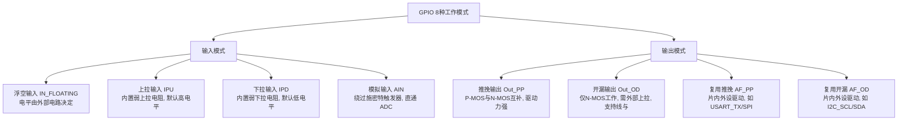
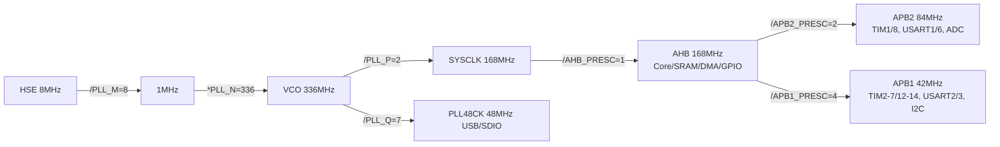
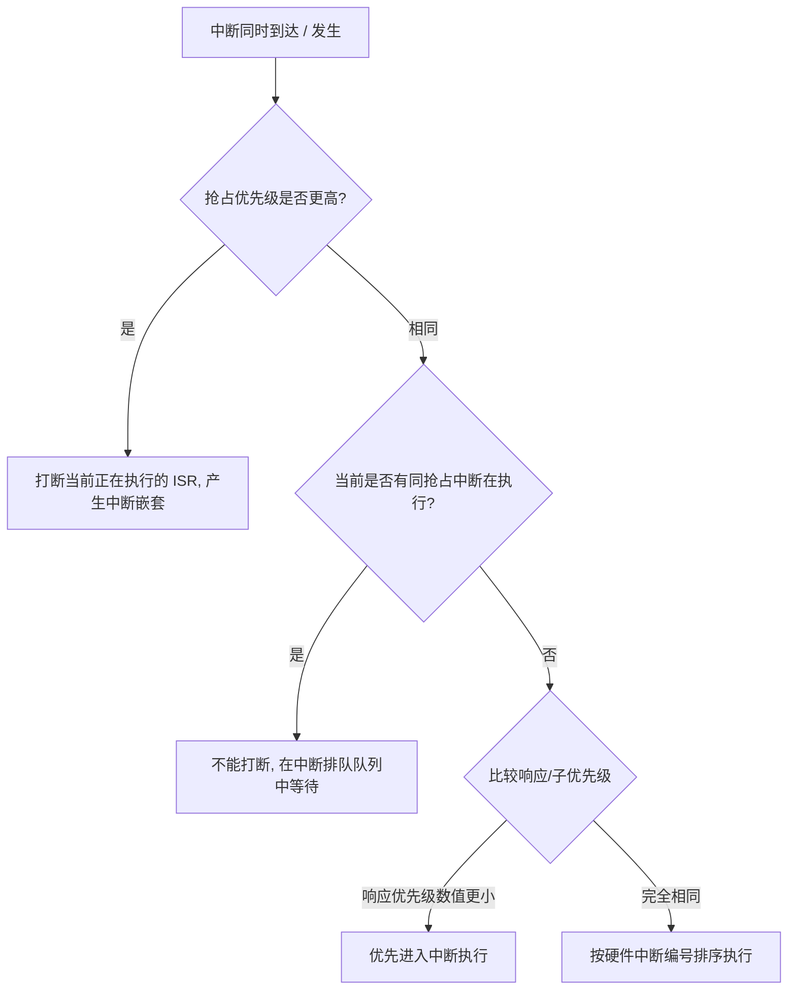
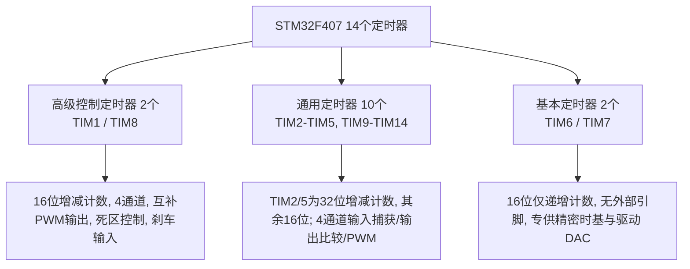
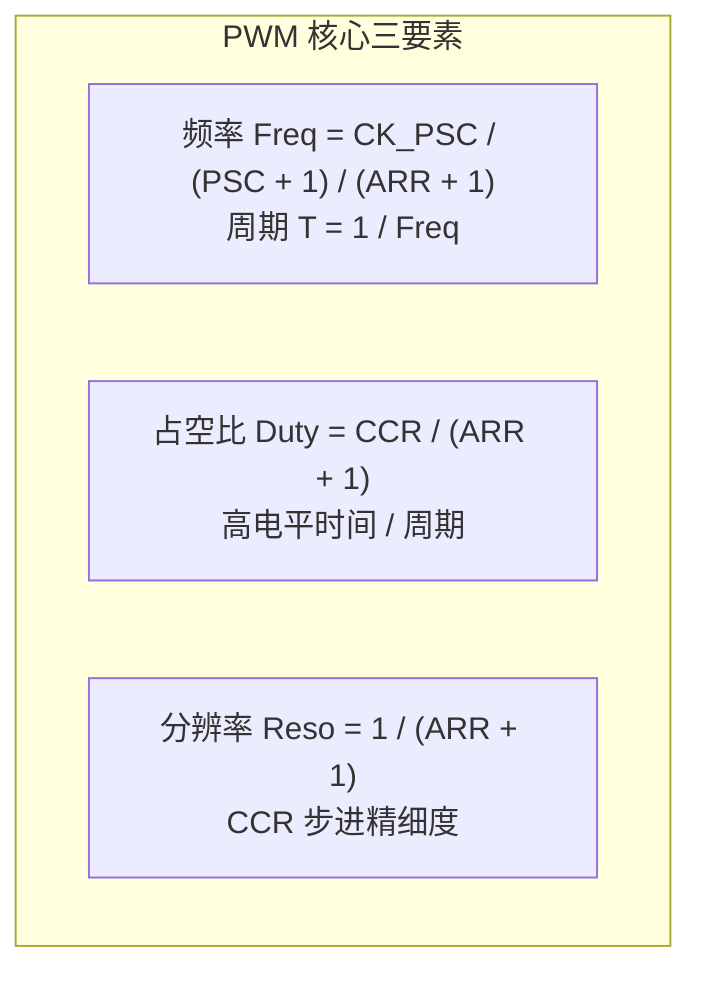
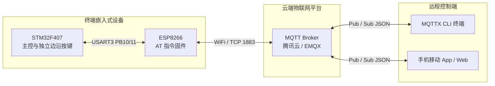

# 📓 周记总结 · 第 36 周（2026-08-31 ~ 2026-09-06）

> **本周主题**：STM32F407 核心外设驱动体系 · 硬件调试仪器三剑客实战 · 定时器/SysTick 与 PWM 电机驱动 · 物联网轻量 MQTT 协议栈 · 工程化 Git 版本控制  
> **学习阶段**：STM32 嵌入式开发进阶 · 核心外设与网络通信实战（STM32F407ZGT6）  
> **配套文档**：`03-GPIO.md`、`04-复位和时钟控制RCC.md`、`05-中断.md`、`05设备教程.md`、`06-定时器.md`、`07-PWM.md`、`Git版本管理.docx`、`issues/stm32f407-esp8266-mqtt-iot.md`  

---

## 一、 本周总览

本周是从“基础理论与电路打板”向“**单片机核心外设底层驱动开发、仪器仪表硬件实操、物联网自研通信栈以及工程化版本管理**”全面跨越的关键一周。

在硬件外设层面，系统攻克了 STM32F407 的 GPIO 寄存器底层映射、RCC 多级时钟树架构与汇编启动流程、NVIC/EXTI 中断优先级与嵌套、基本/通用定时器与 SysTick 滴答时钟、PWM 脉宽调制与 TB6612FNG 电机驱动；在仪器仪表实战层面，系统掌握了万用表、逻辑分析仪、数字示波器的物理接线与调试抓包方法；在网络与系统工程层面，完成了 ESP8266 硬件接入、自研纯 C 轻量级 MQTT 3.1.1 协议栈与双向云控，并规范了 Keil MDK 的 Git 版本控制流水线。

| 模块板块 | 核心研究内容 | 核心技术沉淀与收获 |
|---|---|---|
| **GPIO 进阶与底层机制** | 8 组 IO、8 种工作模式、内部电路拓扑、Cortex-M4 寄存器映射与 `__IO` 机制 | 掌握推挽/开漏本质，建立从寄存器位操作到标准外设库的底层映射直觉 |
| **RCC 复位与时钟体系** | 晶振压电效应、4 大时钟源 + PLL、AHB/APB 分频网络、汇编启动文件剖析 | 理清 168MHz 主频生成链路与 `Reset_Handler` 到 `main()` 的启动全流程 |
| **NVIC & EXTI 中断系统** | 轮询缺陷、抢占与响应优先级、23 路 EXTI 边沿检测、中断 vs 硬件事件 | 建立中断嵌套与排队模型，掌握中断服务函数清除挂起标志位的底层规约 |
| **硬件调试仪器三剑客** | 数字万用表、Saleae 逻辑分析仪、UTD2000E 数字示波器 | 掌握整板功耗测定、连锡/虚焊排查、UART/I2C/SPI 抓包解码与探头电容补偿校准 |
| **定时器与 SysTick** | 14 个定时器分类、基本定时器溢出计算、通用定时器功能、SysTick 滴答时钟 | 掌握精密时基计算公式，实现 1ms 系统心跳与无 OS / 有 OS 精准延时 |
| **PWM 与电机驱动** | 脉宽调制原理、占空比/频率公式、呼吸灯、直流电机与 TB6612FNG H 桥驱动 | 理解数字调制模拟电平原理，掌握 TB6612 软硬件防直通控制与电平真值表 |
| **物联网与 MQTT 协议栈** | 4 路按键边沿解耦、ESP8266 AT 冲突时序优化、自研 MQTT 3.1.1 栈、MQTTX CLI | 纯 C 零内存分配实现报文组包/解析，打通腾讯云/EMQX 双向秒级云控通道 |
| **工程化 Git 版本管理** | 集中式 vs 分布式、Git 四大工作区、分支与冲突解决、Keil MDK `.gitignore` | 建立嵌入式工程版本管理规范，过滤编译临时垃圾文件，保留纯净源码 |

---

## 二、 STM32F407 GPIO 深度剖析与底层机制

### 2.1 端口架构与工作模式

STM32F407ZGT6 拥有 8 组通用 I/O 端口（GPIOA ~ GPIOH），除 GPIOH 仅包含 2 个引脚（PH0/PH1 用于晶振连接）外，其余每组均具备 16 个独立引脚（Pin 0 ~ Pin 15）。

GPIO 引脚可配置为 **8 种工作模式**（4 种输入 + 4 种输出）：



#### 推挽输出 vs 开漏输出核心对比
- **推挽输出（Push-Pull）**：P-MOS 管负责向上拉高至 3.3V（Push），N-MOS 管负责向下拉低至 GND（Pull）。具有对称的高低电平强驱动能力，电平翻转速度快，广泛用于 LED 控制、电平驱动、高速通信引脚。
- **开漏输出（Open-Drain）**：关闭了 P-MOS 管，内部仅能主动输出低电平（N-MOS 导通拉地）；高电平状态下引脚呈高阻悬空，必须依靠外部上拉电阻拉高。**优点**：支持“线与”（多设备引脚并联，只要一个拉低则整线变低）、支持不同电平系统匹配（如通过上拉电阻适配 5V 系统），是 I2C 和 SMBus 总线的标准配置。

### 2.2 内部电路拓扑结构
每个 GPIO 引脚内部包含以下关键保护与调理电路：
1. **输入保护二极管**：两只钳位二极管分别连接至 $V_{DD}$ 与 $V_{SS}$。当引脚外部输入电压高于 $V_{DD} + 0.3V$ 时上方二极管导通分流，当低于 $V_{SS} - 0.3V$ 时下方二极管导通，保护内部核心晶体管不被静电与反向尖峰击穿；
2. **TTL 施密特触发器（Schmitt Trigger）**：内置正向阈值（约 2.7V）和负向阈值（约 1.3V）迟滞比较特性，将缓慢变化或含有小幅杂波的模拟输入信号整形为陡峭规整的方波逻辑信号。但在**模拟输入（AIN）**模式下，施密特触发器被断开，使原始连续变化的模拟电压无损直通 ADC；
3. **可编程上下拉电阻**：阻值约为 30kΩ ~ 50kΩ，在悬空无外部信号输入时，为引脚提供确定的默认高/低电平，消除天线效应引起的电平漂移。

### 2.3 寄存器底层映射与 `__IO` 第一性原理
在 ARM Cortex-M4 架构下，所有的外设寄存器都被映射在 **4GB 统一平坦编址空间**（0x00000000 ~ 0xFFFFFFFF）中。外设区域基地址位于 `0x40000000`：
- **AHB1 总线基地址**：`0x40020000`；
- **GPIOA 基地址**：`0x40020000`（偏移 0x0000）；
- **GPIOF 基地址**：`0x40021400`（偏移 0x1400）。

在固件库头文件 `stm32f407xx.h` 中，ST 采用 C 语言结构体对连续递增的 32 位外设寄存器进行了地址封装：

```c
typedef struct
{
  __IO uint32_t MODER;    /*!< GPIO 端口模式寄存器,              地址偏移: 0x00 */
  __IO uint32_t OTYPER;   /*!< GPIO 端口输出类型寄存器,          地址偏移: 0x04 */
  __IO uint32_t OSPEEDR;  /*!< GPIO 端口输出速度寄存器,          地址偏移: 0x08 */
  __IO uint32_t PUPDR;    /*!< GPIO 端口上拉/下拉寄存器,         地址偏移: 0x0C */
  __IO uint32_t IDR;      /*!< GPIO 端口输入数据寄存器,          地址偏移: 0x10 */
  __IO uint32_t ODR;      /*!< GPIO 端口输出数据寄存器,          地址偏移: 0x14 */
  __IO uint32_t BSRR;     /*!< GPIO 端口置位/复位寄存器,         地址偏移: 0x18 */
  __IO uint32_t LCKR;     /*!< GPIO 端口配置锁定寄存器,          地址偏移: 0x1C */
  __IO uint32_t AFR[2];   /*!< GPIO 复用功能高/低位寄存器,       地址偏移: 0x20-0x24 */
} GPIO_TypeDef;

#define GPIOF ((GPIO_TypeDef *) 0x40021400)
```

> [!IMPORTANT]
> **关于 `__IO` (volatile) 关键字的底层深意**：  
> `__IO` 在 `core_cm4.h` 中被宏定义为 C 语言关键字 `volatile`。寄存器的物理状态随时会被外部硬件电平、外设事件或 DMA 异步改变，哪怕 CPU 自身并未执行任何写入操作。若不加 `volatile`，当开启编译器 `-O2` 或 `-O3` 优化时，编译器会认为该变量“未曾修改”而直接从 CPU 高速缓存/通用寄存器中读取陈旧值，导致无法感知外设与外部引脚的真实状态变化。`volatile` 强制 CPU 每次读取或写入该变量时，必须直接寻址访问该物理内存地址。

### 2.4 标准外设库开发范式与工程规范
标准固件库开发严格遵循“四步法”范式：
1. **定义外设结构体变量**：`GPIO_InitTypeDef GPIO_InitStructure;`；
2. **开启外设总线时钟**：`RCC_AHB1PeriphClockCmd(RCC_AHB1Periph_GPIOF, ENABLE);`（外设时钟默认全关以节能）；
3. **配置外设结构体成员**：配置 `GPIO_Pin`、`GPIO_Mode`、`GPIO_OType`、`GPIO_Speed`、`GPIO_PuPd`；
4. **调用初始化函数写入硬件寄存器**：`GPIO_Init(GPIOF, &GPIO_InitStructure);`。

**工程化目录组织规范**：
- `USER/`：放置 `main.c`、`stm32f4xx_it.c` 核心主干与中断响应；
- `HARDWARE/`：按外设独立划分子文件夹（如 `HARDWARE/LED/led.c`、`led.h`），实现驱动高内聚、低耦合，严禁在 `main.c` 中堆砌外设引脚配置。

### 2.5 机械按键消抖与调试下载实操
- **按键机械抖动原理**：机械触点闭合与断开瞬间由于弹性储能会产生 5ms ~ 10ms 的连续电平震荡（毛刺）。
  - **硬件消抖**：并联 0.1μF 电容利用充放电积分平抑高频杂波，或采用 RS 触发器电路锁存；
  - **软件消抖**：检测到边沿后延时 10ms 再次采样确认，或采用非阻塞状态机轮询采样。
- **J-Link / SWD 调试下载踩坑**：
  - 遇到 `NO CORTEX-M SW DEVICE FOUND` 时，排查杜邦线是否虚接、SWD 与 SWCLK 是否接反；
  - 极端锁死或休眠状态下：**长按开发板复位键（NRST）→ 点击 Keil 的 LOAD 烧录按钮 → 保持 1.5 秒后松开复位键**，可强制打断内核跑飞状态成功下载。

---

## 三、 时钟树架构与复位控制 RCC

### 3.1 时钟的第一性原理与晶振
时钟是数字芯片的心脏与节拍器，决定了 CPU 与外设每秒执行操作的次数。STM32F407ZGT6 的最高主频高达 **168MHz**，即每秒产生 1.68 亿次精准脉冲。
- **晶振物理机制**：利用石英晶体的**压电效应**，在晶片两端施加交变电压产生稳定机械形变振动，反过来产生微弱但极其稳定的交变电场，经反相放大器形成固定周期的基准振荡波。
- **低功耗按需开启架构**：对比 51 单片机“上电全开”的机制，STM32 内部各外设时钟在上电时默认全部处于 Disable（关闭）状态，必须在代码中显式通过 RCC 寄存器开启对应外设的时钟门控信号，大幅降低动态功耗。

### 3.2 四大时钟源与主 PLL 锁相环
STM32F4 内部具备 4 个基础时钟源，结合主锁相环（PLL）构建了高度灵活的时钟拓扑树：

| 时钟源 | 类型与频率 | 精度特点 | 典型用途 |
|---|---|---|---|
| **HSE** (高速外部时钟) | 外部晶体/谐振器，常用 **8MHz**（支持 4~26MHz） | 高精度，温漂小 | 系统主时钟（SYSCLK）首选源，通过 PLL 倍频至 168MHz |
| **HSI** (高速内部时钟) | 内部 RC 振荡器，固定 **16MHz** | 精度一般（受温度影响） | 开机默认启动时钟、HSE 发生故障时的时钟安全保护备用源 |
| **LSE** (低速外部时钟) | 外部 32.768kHz 石英晶体 | 高精度低功耗 | 专为实时时钟（RTC）提供精确计时基准 |
| **LSI** (低速内部时钟) | 内部 32kHz RC 振荡器 | 精度低 | 独立看门狗（IWDG）专用时钟源、低成本 RTC 备用源 |
| **PLL** (锁相环倍频器) | 接收 HSE 或 HSI 进行倍频输出 | 压控振荡器倍频 | 输出 168MHz PLLCLK 驱动内核与总线，输出 48MHz 驱动 USB |

### 3.3 168MHz 主频生成链路与分频总线拓扑
开发板外部接入 **8MHz** 晶振（HSE），通过主 PLL 乘除运算输出 168MHz 系统时钟（SYSCLK），随后层层分频供给三大系统总线：



> [!NOTE]
> **APB 定时器时钟“翻倍”机制**：  
> STM32 硬件规定，当 APB 预分频系数为 1 时，定时器时钟等于 APB 时钟；**当 APB 预分频系数大于 1 时，定时器时钟自动乘以 2**！  
> 因此：
> - 挂载在 APB1（42MHz）上的通用/基本定时器（TIM2~TIM7、TIM12~TIM14）实际时钟为 $42	ext{MHz} 	imes 2 = \mathbf{84MHz}$；
> - 挂载在 APB2（84MHz）上的高级定时器（TIM1、TIM8）实际时钟为 $84	ext{MHz} 	imes 2 = \mathbf{168MHz}$。

### 3.4 启动文件汇编剖析（startup_stm32f40_41xxx.s）
系统上电后，并非直接跳入 `main()`，而是由汇编启动文件完成关键硬件上下文初始化：
1. 分配栈（`STACK`，`__initial_sp`）和堆（`HEAP`）内存空间；
2. 定义中断向量表（Vector Table），将首地址绑定为复位向量 `Reset_Handler`；
3. 执行 `Reset_Handler` 过程：
   ```assembly
   Reset_Handler    PROC
                    EXPORT  Reset_Handler     [WEAK]
                    IMPORT  SystemInit
                    IMPORT  __main
                    LDR     R0, =SystemInit
                    BLX     R0                 ; 调用 SystemInit() 初始化时钟系统
                    LDR     R0, =__main
                    BX      R0                 ; 进入 C 运行时初始化库, 最终跳转至 main()
                    ENDP
   ```
4. `SystemInit()` 在 `system_stm32f4xx.c` 中直接对 `RCC_CR`、`RCC_PLLCFGR`、`RCC_CFGR` 硬件寄存器执行配置，完成 168MHz 初始化。**硬件寄存器写入后立即在物理电路中生效**，而 `SystemCoreClockUpdate()` 仅仅是一个用于同步全局 C 语言软件变量 `SystemCoreClock` 的辅助查询函数。

---

## 四、 异常与中断系统（NVIC & EXTI）

### 4.1 异常 vs 中断与轮询缺陷
- **轮询（Polling）**：CPU 必须在主循环中死循环查询各外设状态位。缺陷显而易见：CPU 利用率被无意义空转占满、系统功耗极高、总线持续处于繁忙状态，且无法实时响应突发紧急事件。
- **中断与异常**：
  - **异常（Exceptions）**：来自 Cortex-M4 **内核内部**的非预期紧急事件（如除零错误、硬件 Fault、内存越界、SVC 指令等）；
  - **中断（Interrupts）**：来自 Cortex-M4 **内核外部片上外设或外部引脚**的硬件事件（如 GPIO 边沿、串口接收数据、定时器溢出）。

### 4.2 NVIC 嵌套向量中断控制器与优先级排队模型
Cortex-M4 内部集成了嵌套向量中断控制器（NVIC），负责统一管理系统异常与 82 个可屏蔽外部中断通道。

每一个中断通道均具有两个层级的优先级参数：
1. **抢占优先级（Preemption Priority）**：决定**打断嵌套**关系。高抢占优先级的中断可以打断正在执行的低抢占优先级中断服务函数，产生中断嵌套；
2. **响应/子优先级（Sub Priority）**：决定**排队先后**关系。当两个抢占优先级相同的中断同时申请响应时，响应优先级高的中断优先进入处理；但响应优先级高的中断**不能打断**已在运行的同抢占优先级中断；
3. **数字越小，优先级越高**；若抢占与响应优先级完全一致，则由硬件固定中断向量表编号（Vector Number）裁决。

通过 `NVIC_PriorityGroupConfig(NVIC_PriorityGroup_x)` 划分 4 位优先级分配比例（一般全局配置为 Group 2，即 2 位抢占优先级支持 0~3 级，2 位响应优先级支持 0~3 级）。



### 4.3 EXTI 外部中断/事件控制器与引脚路由
EXTI 包含多达 23 个独立的边沿检测器：
- `EXTI 0 ~ 15`：对应 16 根 GPIO 输入引脚中断线；
- `EXTI 16`：连接 PVD（电源电压监控）；
- `EXTI 17`：RTC 闹钟事件；
- `EXTI 18`：USB OTG FS 唤醒；
- `EXTI 19`：以太网唤醒；
- `EXTI 20`：USB OTG HS 唤醒；
- `EXTI 21`：RTC 入侵与时间戳；
- `EXTI 22`：RTC 唤醒事件。

> [!WARNING]
> **GPIO 到 EXTI 的“多选一”路由规则**：  
> 虽然每组 GPIO 都有 Pin 0 ~ Pin 15，但同一编号的中断线在同一时刻**只能绑定一个具体的 GPIO 端口**！例如，`EXTI0` 必须在 `PA0, PB0, PC0 ... PI0` 中通过 `SYSCFG_EXTILineConfig(EXTI_PortSourceGPIOA, EXTI_PinSource0)` 挑选其一，不可同时将 PA0 与 PE0 均设为 EXTI0 中断输入。

### 4.4 中断 vs 硬件事件
- **产生中断（Interrupt）**：信号流经边沿检测与门电路后送入 NVIC，触发 CPU 保存现场并跳转执行 C 语言中断服务函数（软件级处理）；
- **产生事件（Event）**：信号不经过 NVIC，而是由内部硬件脉冲发生器输出一个硬件脉冲信号，直接级联触发其他片上外设（如触发 ADC 启动转换、触发 DMA 数据搬运、触发定时器复位），**全程零 CPU 参与，无任何软件中断开销**。

### 4.5 核心防坑：中断服务函数必须手动清除挂起标志
在编写中断服务函数（如 `EXTI0_IRQHandler`）时，**退出函数前必须显式调用 `EXTI_ClearITPendingBit(EXTI_Line0)`**。若漏掉此行代码，硬件挂起寄存器（EXTI_PR）中的置位标志将永远无法清除，CPU 一旦执行退出中断指令，NVIC 会立即再次识别到挂起请求，导致单片机陷入永无止境的死循环，主循环程序彻底卡死。

---

## 五、 硬件调试三剑客实战指南

嵌入式开发不仅是代码编写，更重在**软硬件联合调试**。本周系统演练了万用表、逻辑分析仪与示波器三大硬件调试仪器。


### 5.1 数字万用表（Multimeter）
- **安全红线**：严禁带电测电阻与通断蜂鸣；严禁在表笔接入高压时旋转量程档位；
- **小电容相对测量（REL）**：测量 pF/nF 级小电容时，利用万用表 `REL` 功能减去表笔固有分布电容；
- **整板静态与工作功耗实测**：红表笔接入 mA 档，黑表笔接 COM，将万用表**串联**接入开发板 5V 供电回路中。实测 STM32F407 核心小系统正常运行功耗约为 **30mA @ 5V**（整板静态功率约 $0.15	ext{W}$）；
- **硬件焊接故障定位秘籍**：
  - **引脚连锡短路**：拨至蜂鸣档，红黑表笔点测相邻 MCU 芯片引脚，若蜂鸣器鸣叫且阻值趋近于 0，说明存在微小虚连短路；
  - **引脚虚焊测量**：红表笔接触芯片引脚顶部金属引出端，黑表笔接触 PCB 焊盘铜皮，若蜂鸣器响说明焊接可靠，若不响说明引脚悬空虚焊。

### 5.2 逻辑分析仪（Saleae Logic）
- **仪器特性**：基于高速采样芯片实现 8 通道数字信号捕获，最高采样率 24MHz（根据奈奎斯特采样定律，可精确捕获最高约 6MHz ~ 8MHz 的数字总线信号）；
- **连线核心铁律**：**逻辑分析仪的 GND 必须与待测单片机系统的 GND 严格相连（共地）**，否则由于地电位浮动会导致逻辑阈值误判出现大量伪数据帧；
- **三大协议抓包解码实操**：
  1. **UART 异步串口**：配置 Baudrate（如 115200bps）、8 位数据位、无校验、1 位停止位，成功捕获 AT 指令与回包 ASCII 码；
  2. **I2C 总线**：捕获 SCL 与 SDA 波形，直观观察 START 条件（SCL 高时 SDA 下跳）、8 位地址帧与从机 ACK 响应（第 9 时钟低电平）；
  3. **SPI 总线**：通过 CS、SCK、MOSI、MISO 四线时序，验证 CPOL（时钟极性）与 CPHA（时钟相位）设置是否匹配。

### 5.3 数字示波器（UTD2000E）
- **系统架构**：垂直系统（Voltage/Div，幅值偏转）、水平系统（Time/Div，扫描时基）、触发系统（Trigger，稳定捕捉边沿）；
- **10X 无源探头高阻分压优势**：
  - 1X 档位输入阻抗低（约 1MΩ/100pF），测量高频信号时容性负载效应严重，容易使单片机高速引脚输出波形严重变形；
  - **推荐使用 10X 档位**（输入阻抗 10MΩ/10pF），将待测信号衰减 10 倍输入示波器，大幅降低探头对电路的负载干扰（示波器菜单衰减系数须同步设为 10X）；
- **探头高频补偿电容校正（必做步骤）**：
  - 将探头连接至示波器自带的 1kHz / 3V 基准方波校准端；
  - 若方波顶部向上凸起（过补偿）或顶部向下坍塌（欠补偿），必须使用无感改锥微调探头尾部可调电容，直至方波顶部呈现**绝对平整直角矩形**，保证高频信号测量的保真度；
- **AUTO 自动设置门限**：示波器 AUTO 按键自动搜索信号的硬件门限要求待测信号频率 $\ge 50	ext{Hz}$ 且占空比 $> 1\%$。

---

## 六、 定时器系统与精准时基

### 6.1 STM32F4 定时器家族全景图（共 14 个）
STM32F407 拥有强大的定时器外设阵列，各定时器物理资源完全独立：



### 6.2 基本定时器（TIM6/TIM7）溢出时间精密推导
基本定时器内部包含 16 位预分频器（PSC，分频系数 1 ~ 65536）与 16 位自动重装载寄存器（ARR，0 ~ 65535）。
挂载在 APB1 总线上的 TIM6/7 输入时钟频率为 $T_{clk} = 84	ext{MHz}$。

定时器溢出周期（中断触发时间）计算公式：
$$T_{out} = rac{(ARR + 1) 	imes (PSC + 1)}{T_{clk}}$$

**实战算例（定时精准 1 秒闪烁 LED）**：
- 输入时钟 $T_{clk} = 84	ext{MHz} = 84,000,000	ext{Hz}$；
- 设置预分频系数 $PSC = 8400 - 1 = 8399$，分频后计数器时钟频率为：
  $$f_{cnt} = rac{84,000,000}{8400} = 10,000	ext{Hz}\quad (0.1	ext{ms / 次})$$
- 设置自动重装载值 $ARR = 10000 - 1 = 9999$；
- 则溢出时间为：
  $$T_{out} = rac{10000 	imes 8400}{84,000,000	ext{Hz}} = 1.0	ext{s}$$

### 6.3 通用定时器核心进阶功能
通用定时器支持 3 种计数模式与丰富的通道功能：
1. **向上计数（Upcounting）**：从 0 计数至 ARR 产生溢出更新事件 UEV；
2. **向下计数（Downcounting）**：从 ARR 倒数至 0 产生下溢更新事件；
3. **中央对齐模式（Center-aligned）**：从 0 计至 ARR-1 产生上溢，再倒数至 1 产生下溢（生成对称 PWM 波形，减少电机驱动谐波）；
4. **输入捕获（Input Capture）**：捕获外部方波的上升沿与下降沿瞬间计数值，精确测定脉宽、频率与占空比；
5. **输出比较（Output Compare）**：比较 CNT 与捕获/比较寄存器 CCR 的值，向外部引脚翻转输出波形。

### 6.4 Cortex-M4 内核 SysTick 滴答定时器
SysTick 是集成在 Cortex-M4 内核中的 24 位向下递减定时器。
- **四大核心寄存器**：
  - `CTRL`：控制与状态寄存器（使能位、时钟源选择 FCLK / STCLK、中断使能位、COUNTFLAG 标志）；
  - `LOAD`：24 位自动重装载数值寄存器（最大可装载值 $2^{24}-1 = 16,777,215$）；
  - `VAL`：当前倒计数值寄存器（写操作自动清零并清除 COUNTFLAG）；
  - `CALIB`：系统校准值寄存器。
- **1ms 心跳生成机制**：
  通过 CMSIS 函数配置：`SysTick_Config(SystemCoreClock / 1000);`。在 168MHz 主频下，重装载值设为 168,000，每经过 1ms 触发一次 `SysTick_Handler` 中断。
- **最大定时时间推导**：
  在 168MHz 内核直接时钟驱动下，SysTick 单次倒计数的最大连续计时时间为：
  $$T_{max} = rac{2^{24}}{168,000,000	ext{Hz}} = rac{16,777,216}{168,000,000} pprox 0.09986	ext{s} pprox \mathbf{99.86ms}$$
  若改用 8 分频外部参考时钟（$168	ext{MHz}/8 = 21	ext{MHz}$），最大定时时间可扩展至约 **798.9ms**。

---

## 七、 PWM 脉冲宽度调制与电机驱动

### 7.1 PWM 本质与核心参数
脉冲宽度调制（PWM）利用微处理器的高速数字输出，通过改变方波周期内高电平所占时间的百分比（占空比），对等效模拟电压进行数字编码。



- **PWM1 vs PWM2 模式**：
  - **PWM 模式 1**：递增计数时，当 $CNT < CCR$ 时输出有效电平，否则输出无效电平；
  - **PWM 模式 2**：递增计数时，当 $CNT < CCR$ 时输出无效电平，否则输出有效电平。
- **呼吸灯实战**：配置定时器输出 PWM，在主循环中以非线性阶梯逐步递增和递减 CCR 值，使发光二极管根据人眼视觉暂留特性呈现呼吸起伏效果。

### 7.2 直流有刷电机物理原理与 H 桥拓扑
直流有刷电机由定子（永磁体产生静止磁场）、转子（绕有导线线圈的电枢）和电刷与换向器构成。根据**左手定则**，通电导体在磁场中产生安培力推动转子旋转；当转过 90° 时，换向器自动翻转线圈电流方向，使旋转力矩方向保持不变。

为了在不拔插电源极性的前提下实现电机正反转控制，必须引入 **H 桥驱动电路**：

```
       VCC (VM)
        |
   +----+----+
   |         |
 [Q1]      [Q3]
   |    M    |
   +---(O)---+
   |         |
 [Q2]      [Q4]
   |         |
   +----+----+
        |
       GND
```
- **正转**：导通对角线三极管 Q1 与 Q4，电流从左至右流过电机 M；
- **反转**：导通对角线三极管 Q3 与 Q2，电流从右至左流过电机 M；
- **短路致命风险（直通）**：如果同一侧的 Q1 和 Q2 同时导通，电源正负极将被三极管直接短路拉地，瞬间烧毁管子！

### 7.3 TB6612FNG 双 H 桥驱动芯片架构与防直通逻辑
TB6612FNG 内部集成了高效率低发热的双路 MOSFET 功率 H 桥，其关键设计与引脚定义如下：
1. **硬件防直通逻辑门**：芯片内部通过与门和非门组合逻辑，从物理硬件层面锁死了同一桥臂上下管同时导通的可能性；
2. **工作引脚与真值表**：
   - `VM`：电机动力供电端（4.5V ~ 15V，大电流输入）；
   - `VCC`：内部逻辑供电端（2.7V ~ 5.5V）；
   - `STBY`：待机使能端（高电平正常工作，低电平进入超低功耗休眠）；
   - `PWMA / PWMB`：输入 10kHz 左右 PWM 方波，通过调占空比线性调节转速；
   - `AIN1 / AIN2`：电平换向控制。

| IN1 | IN2 | PWM | STBY | 电机输出状态 (AO1 / AO2) | 功能模式 |
|:---:|:---:|:---:|:---:|:---|:---|
| **H** | **L** | **H** | H | AO1=H, AO2=L | **正转** (Forward) |
| **L** | **H** | **H** | H | AO1=L, AO2=H | **反转** (Reverse) |
| **H** | **H** | - | H | AO1=L, AO2=L | **短路制动** (Brake) |
| **L** | **L** | - | H | 高阻态悬空 | **自然停转** (Coast) |
| - | - | - | **L** | 全部输出断开 | **待机** (Standby) |

---

## 八、 物联网实战：STM32 + ESP8266 自研轻量 MQTT 协议栈

本周与理论同步推进的重大物联网实战已沉淀专篇文档，此处提炼核心技术精髓：
👉 **深度技术沉淀详见**：[🔧 STM32F407 + ESP8266 自研轻量级 MQTT 协议栈与双向物联网云平台实战](issues/stm32f407-esp8266-mqtt-iot.md)



### 核心攻坚亮点
1. **多按键互斥死锁排查与解耦**：
   - 彻底废除全局单一状态锁与严苛的 `key_up==0 && key0==1 && key1==1 && key2==1` 联合松手判断；
   - 设计 **4 路独立边沿状态机**，PA0（高有效）与 PE2/3/4（低有效）各自维护历史周期电平，实现互不干扰、消抖精准的按键检测；
2. **ESP8266 AT 指令时序防冲撞**：
   - 解决单片机由于处理速度极快在收到 `OK` 瞬间连续发包导致的 `busy p...` 状态冲突；
   - 加入状态清空与 20ms 硬件平抑间隔，保证 WiFi 连接与 TCP 透传稳如磐石；
3. **纯 C 语言零内存分配 MQTT 3.1.1 协议栈**：
   - 手工实现 MQTT 固定报头（Fixed Header）变长剩余长度（Remaining Length）编码；
   - 零 `malloc` 堆内存开销，实现 `CONNECT`（附带心跳保活）、`SUBSCRIBE`、`PUBLISH`、`PINGREQ` 报文的高效组包与精准解包；
4. **双向物联网闭环验证**：
   - 开发板按键触发实时组装 JSON 上报云端，云端通过命令行 `mqttx pub` 毫秒级下发指令控制开发板 LED 翻转与开关，实现工业级物联网雏形。

---

## 九、 嵌入式工程化：Git 版本控制规范

### 9.1 集中式 (SVN) vs 分布式 (Git)
- **集中式（SVN）**：版本库唯一集中在中央服务器，开发者只有部分检出工作副本。一旦网络断开无法提交历史，中央服务器损坏则历史记录全部丢失；
- **分布式（Git）**：每个开发者的本地均拥有一份完整的版本库快照（包含全部提交历史与分支）。即便在脱机环境下也能自由 commit、查看 log、切换分支，天然具备极强的容灾备份与分布式协同优势。

### 9.2 Git 四大工作区域
```
+-----------------------------------------------------------------------------------+
|  [工作区 Workspace]  --(git add)-->  [暂存区 Stage/Index]  --(git commit)-->       |
|                                                                                   |
|  --(git push)-->  [本地仓库 Local Repo]  --(git push)-->  [远程仓库 Remote Repo]   |
+-----------------------------------------------------------------------------------+
```
- **工作区（Workspace）**：日常编写 `.c`、`.h` 源码的本地文件目录；
- **暂存区（Stage / Index）**：通过 `git add` 暂存即将提交的文件快照索引；
- **本地仓库（Local Repository）**：通过 `git commit` 保存的历史提交节点链（`.git` 目录）；
- **远程仓库（Remote Repository）**：GitHub / Gitee 代码托管平台，用于团队协同。

### 9.3 Keil MDK 专属 `.gitignore` 规则设计
在嵌入式开发中，Keil MDK 编译时会在工程目录下生成海量的中间产物（如 `*.o`, `*.d`, `*.axf`, `*.map`, `*.crf` 等），这些文件体积庞大、频繁变动且能被重新编译生成，坚决不能提交至版本库中。

**规范级 Keil MDK `.gitignore` 配置**：
```gitignore
# ==========================================
# Keil MDK 嵌入式项目专用忽略规则
# ==========================================

# 忽略所有深度的编译输出目录
**/build/
**/Build/
**/Objects/
**/Listings/
**/DebugConfig/
**/bin/
**/out/

# 忽略编译过程中产生的目标文件与调试中间文件
*.o
*.obj
*.d
*.axf
*.elf
*.map
*.lst
*.lnp
*.crf
*.dep
*.bak
*.tmp
*.htm

# 忽略 Keil IDE 用户配置及窗口排版文件（因人而异）
*.uvguix.*
*.uvgui.*
JLinkSettings.ini

# 日志文件与锁文件
*.log
*.lock

# 特殊保留：确保最终烧录所必需的目标 HEX 文件被 Git 跟踪（可选）
# !/OBJ/*.hex
```

---

## 十、 本周技术沉淀总结与下周规划

### 10.1 本周核心技术沉淀
1. **打通了底层硬件到微内核的认知**：不再把 GPIO 当作简单的“拉高拉低”，而是从晶体管 P-MOS/N-MOS、施密特触发器和 4GB 内存地址空间的结构体指针映射去理解驱动的本质；
2. **掌握了系统级时钟与启动奥秘**：彻底吃透了 8MHz HSE 如何倍频至 168MHz 主频并逐级分频至 AHB/APB 总线，以及单片机上电从汇编 `Reset_Handler` 到 C 语言 `main()` 的完整启动闭环；
3. **软硬协同排障能力大幅跃升**：能够熟练配合万用表测短路/功耗、逻辑分析仪抓 UART/I2C/SPI 总线数据、示波器调探头方波补偿校准，软硬件协同排查疑难杂症；
4. **物联网与协议工程化突破**：不仅完成了基础外设控制，还自研了轻量级二进制变长 MQTT 协议栈，实现了单片机与云端的高可靠双向通信。

### 10.2 下周学习展望
1. **深入学习高级定时器与电机闭环控制**：实操 TIM1/TIM8 互补 PWM 输出、死区时间配置以及基于正交编码器的电机测速闭环；
2. **攻克 ADC / DAC 模拟量采集**：结合 DMA（直接内存访问）实现多通道模拟信号的高速连续采样；
3. **学习 I2C / SPI 硬件控制器与外设芯片驱动**：实操 OLED 显示屏（SSD1306）与 SPI Flash（W25Q64）驱动开发；
4. **FreeRTOS 实时操作系统引入**：从裸机轮询/中断架构平滑过渡到多任务实时抢占内核。

---

## 十一、 本周关键词

`STM32F407` `GPIO底层原理` `推挽与开漏` `volatile` `寄存器映射` `时钟树` `HSE/HSI/PLL` `168MHz` `汇编启动文件` `NVIC` `EXTI外部中断` `中断嵌套与优先级` `硬件调试三剑客` `万用表` `逻辑分析仪Saleae` `示波器探头补偿` `基本/通用定时器` `SysTick滴答定时器` `PWM脉宽调制` `TB6612FNG` `H桥驱动` `ESP8266` `自研MQTT3.1.1` `腾讯云IoT` `Git版本控制` `Keil gitignore`

---

*写于 2026-09-05 · 第 36 周*
