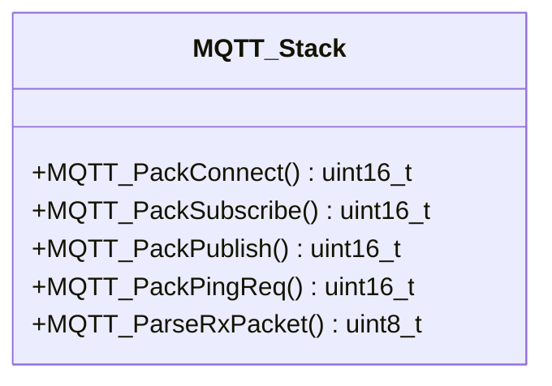
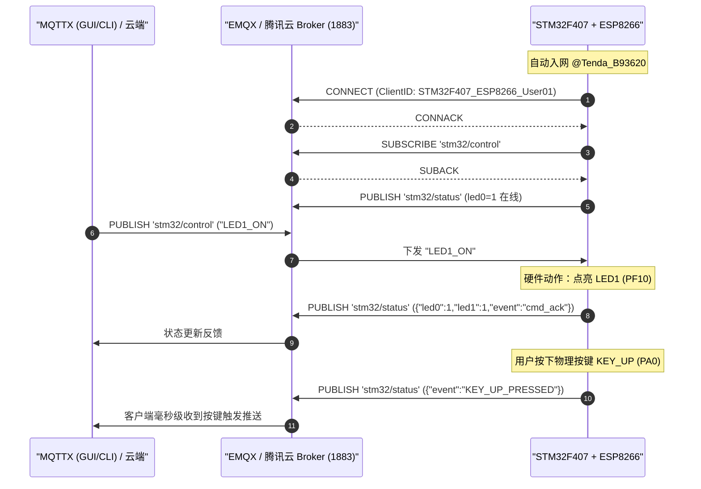

# 🔧 本周问题与知识沉淀：STM32F407 + ESP8266 自研轻量级 MQTT 协议栈与双向物联网云平台实战

> **日期**：2026-09-02  
> **主题**：STM32F407 驱动开发、多按键死锁排查与解耦、ESP8266 AT 冲撞时序优化、纯 C 轻量级 MQTT 3.1.1 协议栈编写、腾讯云/EMQX 平台双向联调与 MQTTX CLI 工具链落地。  
> **适用读者**：嵌入式物联网初学者与进阶者，希望掌握单片机联网、自研协议栈与云平台交互全流程的开发者。

---

## 一、 核心问题与实战背景

在完成基础 GPIO 实验后，本周进入了**网络通信与物联网远程控制**实战阶段。目标是通过 **STM32F407 主控板 + ESP8266 WiFi 模块**，使用 **MQTT 协议** 连接物联网云服务器（腾讯云 / EMQX），实现：
1. 单片机自动连入 WiFi 路由器；
2. 建立 TCP 链路并自主完成 MQTT 3.1.1 协议握手、主题订阅与心跳保活；
3. 云端（MQTTX / 手机 App / 命令行）远程毫秒级控制板载双路 LED 开关与翻转；
4. 板载物理按键（`KEY_UP`, `KEY0`, `KEY1`, `KEY2`）状态变动时，实时上报 JSON 格式数据至云端。

在整个端到端开发与调测过程中，先后遇到了 **多按键状态机死锁**、**ESP8266 硬件跳线与引脚认知偏差**、**AT 指令极速响应引发的时序冲撞（Busy 锁死）**、**云端公共 Broker 系统主题权限（Code 135）** 等一系列高价值技术难点。本文对上述问题进行彻底的复盘与深度沉淀。

---

## 二、 难点一：多按键状态机互斥死锁与独立边沿解耦

### 2.1 故障现象与痛点
在实现 `KEY_UP` (PA0)、`KEY0` (PE4)、`KEY1` (PE3)、`KEY2` (PE2) 扫描时，出现了以下严重问题：
1. 开机后按键偶发不响应或存在明显延迟，按键“不跟手”；
2. 在多次按下或触发一次 `KEY_UP` 后，其他按键 `KEY0 / KEY1 / KEY2` 完全失效，单片机再也无法检测到任何按键动作。

### 2.2 根因深度剖析
原有的按键扫描逻辑存在两个致命缺陷：

#### 缺陷 1：全局状态锁混用
4 个按键共用了一个静态状态变量 `static uint8_t key_up_state = 1;`。当检测到任意按键按下时，直接将该变量置 0。

#### 缺陷 2：苛刻的全部松手判断导致永久死锁
在松手复位逻辑中，代码写为了：
```c
else if (key_up == 0 && key0 == 1 && key1 == 1 && key2 == 1)
{
    key_up_state = 1; // 所有按键均已松开才能恢复检测
}
```
* **硬件特性**：`KEY_UP` (PA0) 为高电平有效（按下为 1，松开为 0）；`KEY0/1/2` 为低电平有效（按下为 0，松开为 1）。
* **死锁逻辑**：该判断**强行要求所有 4 个按键必须同时、分毫不差地处于松开电平**才能复位。如果 `PA0` 在开机时存在微小浮空漏电、电容放电迟缓、或按键机械抖动未完全回到 0，`key_up == 0` 就永远为假！
* **连锁反应**：`key_up_state` 永远卡死在 0，后续代码再也无法进入检测分支，导致开发板上的所有物理按键全军覆没。

### 2.3 架构重构：4 路独立边沿检测状态机
将 4 个物理按键**彻底解耦**，每个按键各自维护上一周期的电平状态，基于硬件电平跳变（边沿）进行独立消抖与触发：

```c
/**
 * @brief  独立按键边沿检测扫描函数（4路按键彻底解耦，互不干扰）
 * @retval KEY_UP_PRES(1), KEY0_PRES(2), KEY1_PRES(3), KEY2_PRES(4), KEY_NONE(0)
 */
uint8_t Key_Scan(void)
{
    static uint8_t s_last_key_up = 0;
    static uint8_t s_last_key0 = 1;
    static uint8_t s_last_key1 = 1;
    static uint8_t s_last_key2 = 1;

    uint8_t curr_key_up = GPIO_ReadInputDataBit(GPIOA, GPIO_Pin_0);
    uint8_t curr_key0   = GPIO_ReadInputDataBit(GPIOE, GPIO_Pin_4);
    uint8_t curr_key1   = GPIO_ReadInputDataBit(GPIOE, GPIO_Pin_3);
    uint8_t curr_key2   = GPIO_ReadInputDataBit(GPIOE, GPIO_Pin_2);

    /* 1. KEY_UP (PA0, 0->1 上升沿独立触发) */
    if (curr_key_up == 1 && s_last_key_up == 0)
    {
        delay_ms(15);
        if (GPIO_ReadInputDataBit(GPIOA, GPIO_Pin_0) == 1)
        {
            s_last_key_up = 1;
            return KEY_UP_PRES;
        }
    }
    s_last_key_up = curr_key_up;

    /* 2. KEY0 (PE4, 1->0 下降沿独立触发) */
    if (curr_key0 == 0 && s_last_key0 == 1)
    {
        delay_ms(15);
        if (GPIO_ReadInputDataBit(GPIOE, GPIO_Pin_4) == 0)
        {
            s_last_key0 = 0;
            return KEY0_PRES;
        }
    }
    s_last_key0 = curr_key0;

    /* 3. KEY1 (PE3, 1->0 下降沿独立触发) */
    if (curr_key1 == 0 && s_last_key1 == 1)
    {
        delay_ms(15);
        if (GPIO_ReadInputDataBit(GPIOE, GPIO_Pin_3) == 0)
        {
            s_last_key1 = 0;
            return KEY1_PRES;
        }
    }
    s_last_key1 = curr_key1;

    /* 4. KEY2 (PE2, 1->0 下降沿独立触发) */
    if (curr_key2 == 0 && s_last_key2 == 1)
    {
        delay_ms(15);
        if (GPIO_ReadInputDataBit(GPIOE, GPIO_Pin_2) == 0)
        {
            s_last_key2 = 0;
            return KEY2_PRES;
        }
    }
    s_last_key2 = curr_key2;

    return KEY_NONE;
}
```

---

## 三、 难点二：ESP8266 硬件跳线与 AT 指令冲撞优化

### 3.1 硬件接口丝印与引脚对应
开发板板载的 WiFi 接口丝印为：
```
RXD   GPO   GP2   GND
3V3   RST   PD    TXD
```
* **引脚定义**：对应标准的 ESP-01 / ESP-01S 模块封装。其中 `GPO` 即 `GPIO0`，`GP2` 即 `GPIO2`，`PD` 即 `CH_PD`（使能脚，高电平工作）。
* **物理串口与跳线器**：模块直接插在板载 P1 插座上。查阅原理图，STM32 驱动该插座需要通过 **P5 跳线帽** 进行路由：
  - **P5 的 3-5 短接**：将 `PB10` (USART3_TX) 连通至 ESP8266 的 RXD；
  - **P5 的 4-6 短接**：将 `PB11` (USART3_RX) 连通至 ESP8266 的 TXD。

### 3.2 AT 指令时序竞争与 Busy 冲撞解决方案
在单片机与 ESP8266 通信时，遇到了 `AT+CIPSEND` 返回 `busy` 或无法获取 `>` 提示符导致通信挂死的问题。

* **时序根因**：
  1. STM32 发送 `MQTT CONNECT` 报文给 ESP8266；
  2. ESP8266 将数据通过 TCP 发给云端 Broker；
  3. 云端 Broker 响应极快，在数毫秒内即通过 TCP 下发了 `CONNACK` 报文；
  4. ESP8266 接收到数据并触发串口下发 `+IPD`；
  5. 此时 STM32 紧接着发出下一条 `AT+CIPSEND`（发送 `SUBSCRIBE`），恰好撞上 ESP8266 正在处理接收中断与状态切换，模块直接返回 `busy` 拒绝执行！
* **工程优化措施**：
  1. **状态恢复缓冲**：在每个报文发送成功（`SEND OK`）后，主动预留 50ms 的状态机缓冲时间；
  2. **带重试与超时判定的安全发包机制**：如果检测到 `busy` 或未在预期时间内收到 `>`，自动进行最多 3 次指数退避重试；
  3. **心跳与断线重连守护**：加入每 25 秒自动保活机制，若检测到 `CLOSED` 信号，状态机自动触发重新建连与重新订阅。

---

## 四、 核心实现：自研轻量级纯 C 语言 MQTT 3.1.1 协议栈

为了在无需引入庞大第三方库（如 FreeRTOS / Paho-Embedded）的前提下实现高效稳定的 MQTT 通信，自研了一套**零动态内存分配（Zero Dynamic Allocation）**的轻量级编解码协议栈。

### 4.1 协议层核心数据结构
```c
#define MQTT_PKT_CONNECT     0x10
#define MQTT_PKT_CONNACK     0x20
#define MQTT_PKT_PUBLISH     0x30
#define MQTT_PKT_PUBACK      0x40
#define MQTT_PKT_SUBSCRIBE   0x80
#define MQTT_PKT_SUBACK      0x90
#define MQTT_PKT_PINGREQ     0xC0
#define MQTT_PKT_PINGRESP    0xD0

typedef struct {
    char topic[64];
    char payload[256];
    uint16_t payload_len;
} MQTT_Msg_t;
```

### 4.2 变长剩余长度（Remaining Length）编码与解码算法
MQTT 协议使用 1~4 字节的变长编码表示报文剩余长度，最高位为续存位（1 表示后续还有字节）：

```c
/* 变长长度编码函数 */
static uint8_t encode_remaining_length(uint8_t *buf, uint32_t length)
{
    uint8_t encoded_bytes = 0;
    uint8_t digit;
    do {
        digit = length % 128;
        length /= 128;
        if (length > 0)
            digit |= 0x80;
        buf[encoded_bytes++] = digit;
    } while (length > 0);
    return encoded_bytes;
}
```

### 4.3 核心报文打包函数（CONNECT / SUBSCRIBE / PUBLISH / PINGREQ）



* **CONNECT 报文打包**：组装协议名 `"MQTT"`、协议等级 `0x04` (3.1.1)、CleanSession 标志、KeepAlive 保持时间及 ClientID。
* **SUBSCRIBE 报文打包**：组装固定报头 `0x82`、Packet Identifier、主题过滤器与请求 QoS 等级（QoS 0）。
* **PUBLISH 报文打包**：组装固定报头 `0x30`、主题名称与 JSON 格式的 Payload 载荷。
* **报文解析器 `MQTT_ParseRxPacket`**：从串口数据流中精准提取出 Publish 主题与指令载荷。

---

## 五、 云端对接与排查沉淀

### 5.1 腾讯云服务器与安全组配置
1. **Ubuntu 服务器环境部署**：
   - 安装并启动 `mosquitto` 守护进程；
   - 配置 `/etc/mosquitto/conf.d/default.conf`：
     ```ini
     listener 1883 0.0.0.0
     allow_anonymous true
     ```
2. **腾讯云安全组规则**：
   - 必须在控制台安全组入站规则中放行 **TCP 1883 端口**，否则外网单片机 TCP 握手将被防火墙直接丢弃（DROP）。

### 5.2 公共 Broker 报错 Code: 135 的权威解析
在使用 MQTTX 连接公共 Broker（`broker.emqx.io`）时，日志出现如下报错：
```text
[ERROR] Failed to subscribe: $SYS/#, Error: Not authorized (Code: 135).
```
* **知识沉淀**：
  - `$SYS/#` 主题属于 MQTT Broker 的**系统集群监控主题**（用于监控全集群 CPU、在线总数、内存占用等）；
  - 公共测试服务器出于安全防护，**禁止匿名客户端订阅 `$SYS/#` 内部指标**（ACL 访问控制返回 135 未授权）；
  - **此报错完全不影响任何业务主题**！所有的用户业务主题（如 `stm32/control` 和 `stm32/status`）均畅通无阻。

---

## 六、 客户端工具链与端到端测试

### 6.1 MQTTX CLI (v1.13.0) 命令行实战
从 GitHub 官方 Release 部署了最新的 Windows x64 `mqttx-cli` 至 `D:\MQTTX\cli\mqttx.exe` 并配置入系统环境变量：

* **实时状态订阅监听**：
  ```powershell
  mqttx sub -h broker.emqx.io -t stm32/status
  ```
* **命令行远程控制下发**：
  ```powershell
  # 翻转 LED1 状态
  mqttx pub -h broker.emqx.io -t stm32/control -m "LED1_TOGGLE"

  # 熄灭全部 LED
  mqttx pub -h broker.emqx.io -t stm32/control -m "ALL_OFF"
  ```

### 6.2 端到端通信时序与实测效果



---

## 七、 总结与心得

1. **底层状态机的严谨性至关重要**：嵌入式按键扫描绝不能简单共用变量或使用过于严苛的复合条件，独立边沿检测是保证系统长期可靠运行的金科玉律；
2. **硬件时序与缓冲意识**：串口通信与 AT 模块交互必须严格考虑模块内部的状态机转换耗时，加入合理的延时与重试策略是攻克“通信偶发假死”的核心秘诀；
3. **协议自主实现带来的掌控力**：脱离重型库束缚，亲手实现基于字节流的 MQTT 3.1.1 编解码，对物联网协议底层的报文格式、变长算法与心跳保活有了刻骨铭心的理解。
